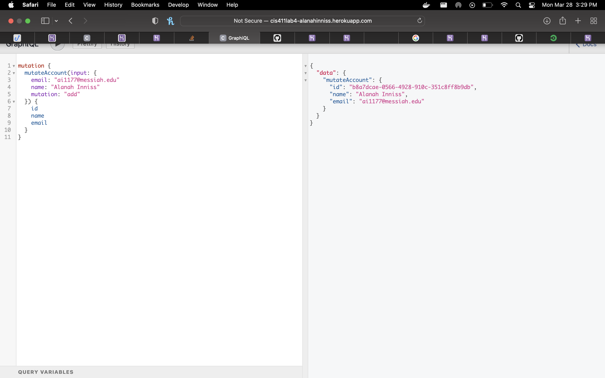

# Lab Report: UX/UI
___
**Course:** CIS 411, Spring 2021  
**Instructor(s):** [Trevor Bunch](https://github.com/trevordbunch)  
**Name:** Ammanuel Tamrat
**GitHub Handle:** AmmanuelT  
**Repository:** https://github.com/AmmanuelT/cis411_lab4_CD
**Collaborators:** 
___

# Required Content

- [x] Generate a markdown file in the labreports directoy named LAB_[GITHUB HANDLE].md. Write your lab report there.
- [x] Create the directory ```./circleci``` and the file ```.circleci/config.yml``` in your project and push that change to your GitHub repository.
- [x] Create the file ```Dockerfile``` in the root of your project and include the contents of the file as described in the instructions. Push that change to your GitHub repository.
- [x] Embed _using markdown_ a screenshot of your successful build and deployment to Heroku of your project (with the circleci interface).  
> Successful Build 
- [x] Write the URL of your running Heroku app here (and leave the deployment up so that I can test it):  
> URL: [http://cis411lab4-ammanuelt.herokuapp.com/graphql](http://cis411lab4-ammanuelt.herokuapp.com/graphql)  
> 
- [x] Answer the **4** questions below.
- [x] Submit a Pull Request to cis411_lab4_CD and provide the URL of that Pull Request in Canvas as your URL submission.

## Questions
1. Why would a containerized version of an application be beneficial if you can run the application locally already?
> Having a containerized version of an application makes it so that everyone working on the application can run it in a similar environment. This way we know that there won't be problems with the app due to the way that a person's local environment is configured.
2. If we have the ability to publish directory to Heroku, why involve a CI solution like CircleCI? What benefit does it provide?
> Involving a CI solution like Circle CI allows us to run scripts before deploying directly to Heroku. Having this option means that test scripts can be run before deploying so that resources are not wasted. In addition, Circle CI allows us to have complex pipelines involving different technologies.
3. Why would you use a container technology over a virtual machine(VM)?
> VMs run their own complete operating system while containers run on the existing operating system's kernel which means that they take up less space. In addition, a system can host many containers when needed as they require fewer resources. Finally, the capacity to start and stop containers easily makes it easier to conserve resources.
4. What are some alternatives to Docker for containerized deployments?
> Kubernetes, Red Hat OpenShift, and Cloud Foundry are popular alternatives to Docker for containerized deployments.