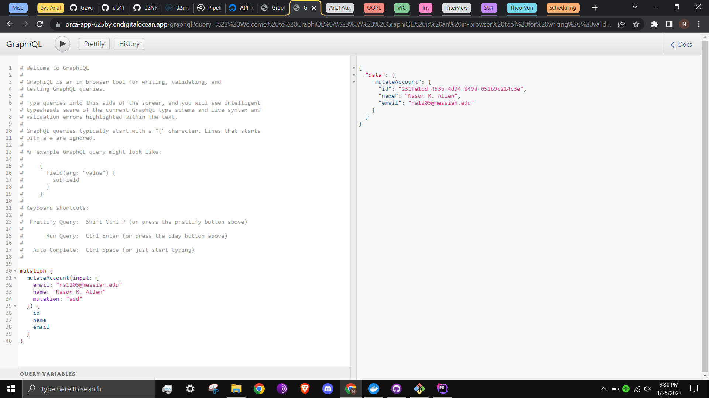
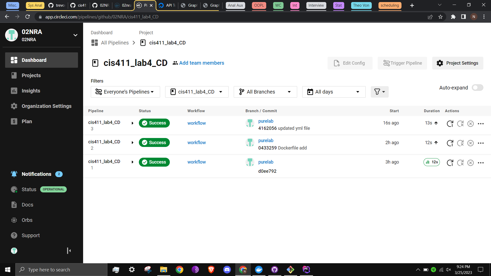

# Lab Report: UX/UI
___
**Course:** CIS 411, Spring 2021  
**Instructor(s):** [Trevor Bunch](https://github.com/trevordbunch)  
**Name:** Nason R. Allen  
**GitHub Handle:** 02NRA  
**Repository:** [https://github.com/02NRA/cis411_lab4_CD](https://github.com/02NRA/cis411_lab4_CD)  
**Collaborators:** Aidan Hubley
___

# Required Content

- [x] Generate a markdown file in the labreports directory named LAB_[GITHUB HANDLE].md. Write your lab report there.
- [x] Create the directory ```./circleci``` and the file ```.circleci/config.yml``` in your project and push that change to your GitHub repository.
- [x] Create the file ```Dockerfile``` in the root of your project and include the contents of the file as described in the instructions. Push that change to your GitHub repository.
- [x] Write the URL of your app hosted on Heroku or other Cloud Provider here:  
> Submission: [https://orca-app-625by.ondigitalocean.app/graphql](https://orca-app-625by.ondigitalocean.app/graphql)
- [x] Embed _using markdown_ a screenshot of your successful deployed application to Digital Ocean.  
> Submission: 
- [x] Embed _using markdown_ a screenshot of your successful build and deployment to Digital Ocean of your project (with the circleci interface).  
> Submission: 
- [x] Answer the **4** questions below.
- [x] Submit a Pull Request to cis411_lab4_CD and provide the URL of that Pull Request in Canvas as your URL submission.

## Questions
1. Why would a containerized version of an application be beneficial if you can run the application locally already?
> Containerization allows developers to ensure that their app works across operating systems and environments, in case the development team are using multiple different systems internally, or they are deploying to multiple different systems. Yu can read more about this from CircleCI itself here: [https://circleci.com/blog/benefits-of-containerization/?utm_source=google&utm_medium=sem&utm_campaign=sem-google-dg--uscan-en-dsa-tROAS-auth-nb&utm_term=g_-_c__dsa_&utm_content=&gclid=Cj0KCQjwt_qgBhDFARIsABcDjOdIpRmYOD9TY-MFcexBsFdLd9BH7v-utPtle3sbSmB40pOyy15O5ooaAvocEALw_wcB](https://circleci.com/blog/benefits-of-containerization/?utm_source=google&utm_medium=sem&utm_campaign=sem-google-dg--uscan-en-dsa-tROAS-auth-nb&utm_term=g_-_c__dsa_&utm_content=&gclid=Cj0KCQjwt_qgBhDFARIsABcDjOdIpRmYOD9TY-MFcexBsFdLd9BH7v-utPtle3sbSmB40pOyy15O5ooaAvocEALw_wcB).
2. If we have the ability to publish directory to Heroku, why involve a CI solution like CircleCI? What benefit does it provide?
> Circle CI can show us the nonfatal errors that may not show even if the app successfully deploys. CircleCI can also test multiple branches, rather than having to deploy an app to discover its issues. Essentially, it gives us the confidence to have a faster time to market (elaborated on below, and here: [https://codefresh.io/learn/continuous-delivery/what-is-continuous-deployment/#:~:text=Continuous%20deployment%20provides%20numerous%20benefits,customer%20needs%20and%20market%20conditions.](https://codefresh.io/learn/continuous-delivery/what-is-continuous-deployment/#:~:text=Continuous%20deployment%20provides%20numerous%20benefits,customer%20needs%20and%20market%20conditions.))
3. Why would you use a container technology over a virtual machine(VM)?
> Containers are "lighter weight", or consume fewer hardware resources than virtual machines do, so you can both have more of them for the same hardware budget, and destroy and remake them faster in an urgent situation. Pay special attention to the charts in this experiment that demonstrate this concept: [https://www.diva-portal.org/smash/get/diva2:1412070/FULLTEXT01.pdf](https://www.diva-portal.org/smash/get/diva2:1412070/FULLTEXT01.pdf)
4. What are some alternatives to Docker for containerized deployments?
> Many companies offer this service because it is so necessary in a modern software market. Notably, IBM ([https://www.ibm.com/topics/containerization](https://www.ibm.com/topics/containerization)) and Amazon ([https://www.google.com/aclk?sa=l&ai=DChcSEwjEg4Lbvfj9AhU0HGUKHc4ODdIYABADGgJ5bQ&sig=AOD64_2nfhMiLRDjci5_RqQLWcntqbpmkg&q&adurl&ved=2ahUKEwib7fnavfj9AhX7EFkFHSubBdcQ0Qx6BAgJEAM](https://www.google.com/aclk?sa=l&ai=DChcSEwjEg4Lbvfj9AhU0HGUKHc4ODdIYABADGgJ5bQ&sig=AOD64_2nfhMiLRDjci5_RqQLWcntqbpmkg&q&adurl&ved=2ahUKEwib7fnavfj9AhX7EFkFHSubBdcQ0Qx6BAgJEAM)) have their own.