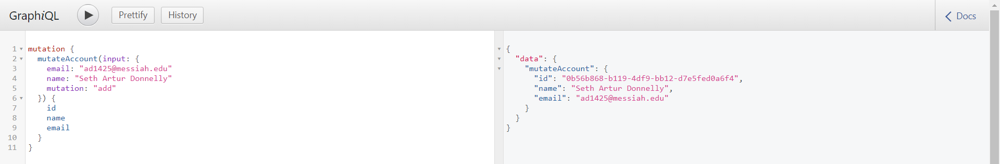

# Lab Report: UX/UI
___
**Course:** CIS 411, Spring 2021  
**Instructor(s):** [Trevor Bunch](https://github.com/trevordbunch)  
**Name:** Artur Donnelly  
**GitHub Handle:** [ArturD0nnelly](https://github.com/ArturD0nnelly)  
**Repository:** [cis411_lab4_CD](https://github.com/ArturD0nnelly/cis411_lab4_CD)  
**Collaborators:** [Alec Chappell](https://github.com/alecclyde)
___

# Required Content

- [x] Generate a markdown file in the labreports directoy named LAB_[GITHUB HANDLE].md. Write your lab report there.
- [x] Create the directory ```./circleci``` and the file ```.circleci/config.yml``` in your project and push that change to your GitHub repository.
- [x] Create the file ```Dockerfile``` in the root of your project and include the contents of the file as described in the instructions. Push that change to your GitHub repository.
- [x] Write the URL of your running Heroku app here:  
> Example: [https://cis411lab4-happyartur.herokuapp.com/graphql](https://cis411lab4-happyartur.herokuapp.com/graphql)
- [x] Embed _using markdown_ a screenshot of your successful build and deployment to Heroku of your project.  
> Example: 
- [x] Answer the **4** questions below.
- [x] Submit a Pull Request to cis411_lab4_CD and provide the URL of that Pull Request in Canvas as your URL submission.

## Questions
1. Why would a containerized version of an application be beneficial if you can run the application locally already?
> With the container all of the members of the project would be able to run the applications without the need of downloading a lot of programs. 
2. If we have the ability to publish a directory to Heroku, why involve a CI solution like CircleCI? What benefit does it provide?
> CiscleCi is like a middle man. Before the code goes live it goes through CircleCi so it can be tested to make sure that the code is deployable. It checks to make sure that there are no errors.
3. Why would you use container technology over a virtual machine(VM)?
> The VM is much longer to set up, also VM takes a lot of OS resources. So, a lot of disc space would be saved if using the container. Also, there is no virtualization needed with Docker since it runs directly on the host OS.
4. What are some alternatives to Docker for containerized deployments?
> [rkt](https://www.openshift.com/learn/topics/rkt) , [Hyper-V](https://docs.microsoft.com/en-us/virtualization/windowscontainers/manage-containers/hyperv-container), [LXC](https://linuxcontainers.org/)