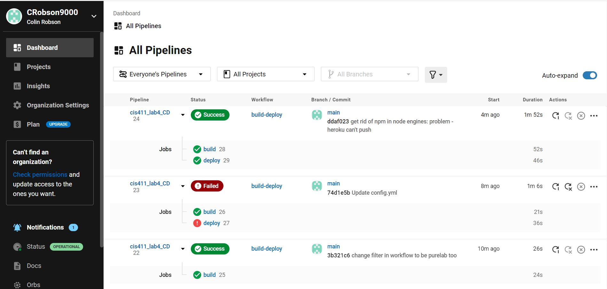
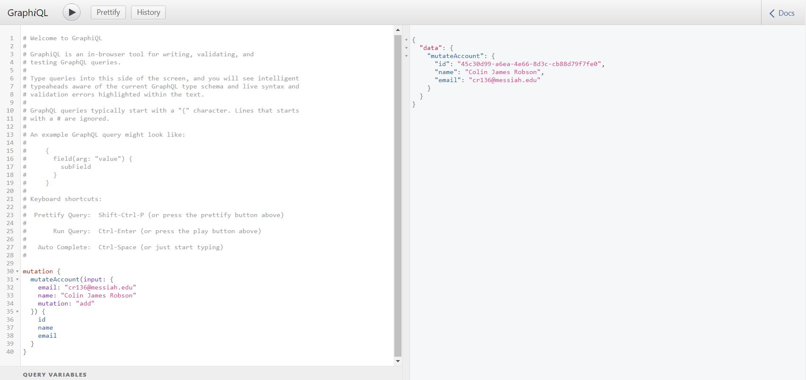

# Lab Report: UX/UI
___
**Course:** CIS 411, Spring 2021  
**Instructor(s):** [Trevor Bunch](https://github.com/trevordbunch)  
**Name:** Colin Robson  
**GitHub Handle:** @CRobson9000  
**Repository:** [My Repository](https://github.com/CRobson9000/cis411_lab4_CD)  
___

# Required Content

- [x] Generate a markdown file in the labreports directoy named LAB_[GITHUB HANDLE].md. Write your lab report there.
- [x] Create the directory ```./circleci``` and the file ```.circleci/config.yml``` in your project and push that change to your GitHub repository.
- [x] Create the file ```Dockerfile``` in the root of your project and include the contents of the file as described in the instructions. Push that change to your GitHub repository.
- [x] Embed _using markdown_ a screenshot of your successful build and deployment to Heroku of your project (with the circleci interface).  
    #### Successful Build ####
    
- [x] Write the URL of your running Heroku app here (and leave the deployment up so that I can test it): 
    - URL - https://cis411lab4-crobson9000.herokuapp.com/graphql  
    #### Successful Test on Deployed URL ####
    
- [x] Answer the **4** questions below.
- [x] Submit a Pull Request to cis411_lab4_CD and provide the URL of that Pull Request in Canvas as your URL submission.

## Questions
1. Why would a containerized version of an application be beneficial if you can run the application locally already?
> Using a container makes running the application universal because it allows it to be run on all different kinds of machines.  Tis is because running in a container sets standards and makes sure that each machine that uses the code has what it needs to run the code without errors.  
2. If we have the ability to publish a directory to Heroku, why involve a CI solution like CircleCI? What benefit does it provide?
> Heroku deals with code deployment while Circle CI deals more with integration.  Circle CI makes sure your code is integrated among all of other platforms (like Heroku) and allows you to perform tests to make sure it works properly.  Its a way of automated the whole process from commiting your code to deploying it. An app like Heroku deploys your code so that others can see and use your app. 
3. Why would you use a container technology over a virtual machine(VM)?
> A container technology takes up less space than a virtual machine because it's only an image of the environment while a virtual machine is basically a whole other environment / operating system.  Using container technology is just generally more light-weight as it takes less time to spin up, uses less resources, and is easier to manage and manipulate. 
4. What are some alternatives to Docker for containerized deployments?
> Some alternatives to Docker are Podman, OpenVZ, Virtual Box, Kubernetes, and LXC (Linux Containers).