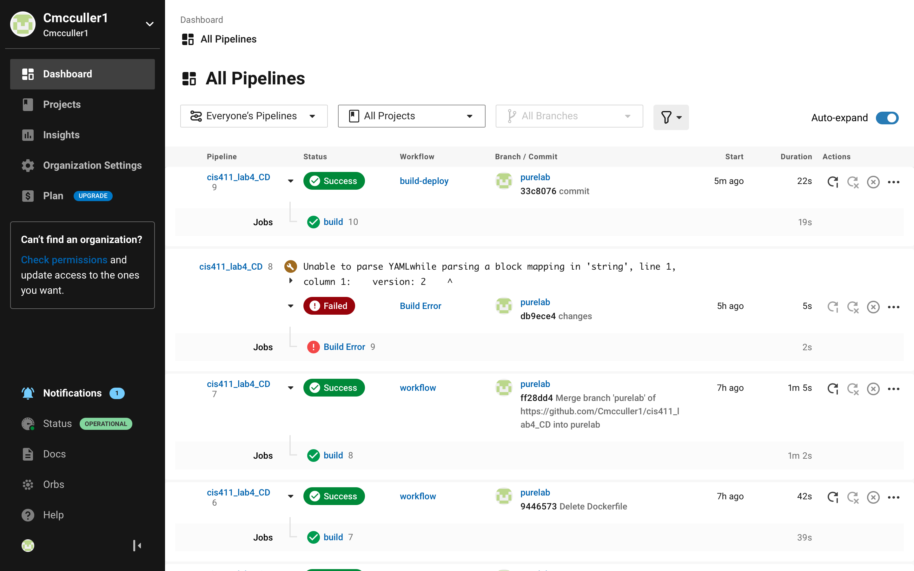
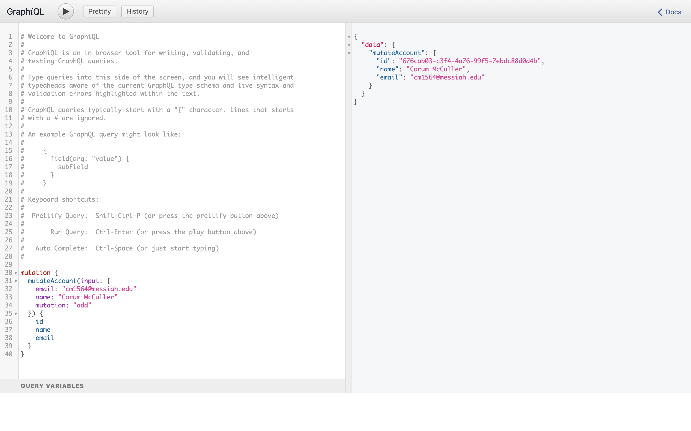

# Lab Report: UX/UI
___
**Course:** CIS 411, Spring 2021  
**Instructor(s):** [Trevor Bunch](https://github.com/trevordbunch)  
**Name:** Corum McCuller 
**GitHub Handle:** cmcculler1

**Repository:** https://github.com/Cmcculler1/cis411_lab4_CD.git

**Collaborators:** richard-pokrivka, kfirestone25
___

# Required Content

- [ x] Generate a markdown file in the labreports directoy named LAB_[GITHUB HANDLE].md. Write your lab report there.
- [ x] Create the directory ```./circleci``` and the file ```.circleci/config.yml``` in your project and push that change to your GitHub repository.
- [ x] Create the file ```Dockerfile``` in the root of your project and include the contents of the file as described in the instructions. Push that change to your GitHub repository.
- [ x] Embed _using markdown_ a screenshot of your successful build and deployment to Heroku of your project (with the circleci interface).  
> Example: 
- [ ] Write the URL of your running Heroku app here (and leave the deployment up so that I can test it):  
> Link: [http://cis411lab4-cmcculler1.herokuapp.com/graphql](http://cis411lab4-cmcculler1.herokuapp.com/graphql)  
> 
- [ ] Answer the **4** questions below.
- [ ] Submit a Pull Request to cis411_lab4_CD and provide the URL of that Pull Request in Canvas as your URL submission.

## Questions
1. Why would a containerized version of an application be beneficial if you can run the application locally already?
> It allows you to ensure that the application runs the same across all devices. 
2. If we have the ability to publish directory to Heroku, why involve a CI solution like CircleCI? What benefit does it provide?
> CircleCI allows you to test your code before you deploy it.It allows you to recognize errors before you try and deploy your app.
3. Why would you use a container technology over a virtual machine(VM)?
> Containers require less system resources than traditional virtual machines. Along with that comes increased portability and greater efficiency.
4. What are some alternatives to Docker for containerized deployments?
> Artifactory Docker Registry, LXC, Hyper-V and Windows container, RKT, and podman are all alternatives to docker.