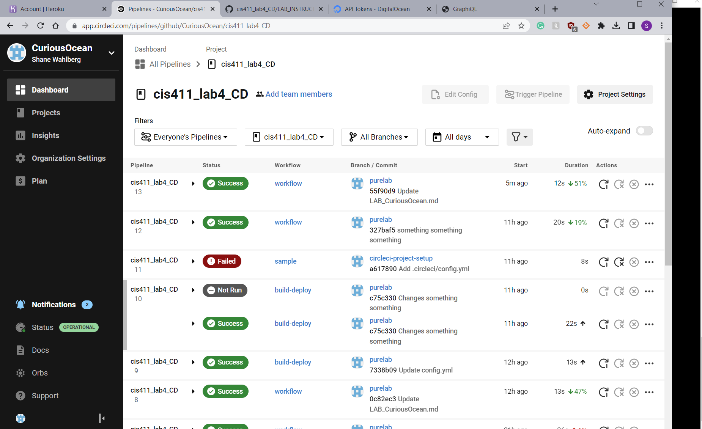

# Lab Report: UX/UI
___
**Course:** CIS 411, Spring 2021  
**Instructor(s):** [Trevor Bunch](https://github.com/trevordbunch)  
**Name:** Shane Wahlberg 
**GitHub Handle:** CuriousOcean 
**Repository:** Your Forked Repository  
**Collaborators:** 
___

# Required Content

- [x] Generate a markdown file in the labreports directory named LAB_[GITHUB HANDLE].md. Write your lab report there.
- [x] Create the directory ```./circleci``` and the file ```.circleci/config.yml``` in your project and push that change to your GitHub repository.
- [x] Create the file ```Dockerfile``` in the root of your project and include the contents of the file as described in the instructions. Push that change to your GitHub repository.
- [x] Write the URL of your app hosted on DigitalOcean here:  
> Proof: [Shane's website](https://plankton-app-yhrto.ondigitalocean.app/graphql)
- [x] Embed _using markdown_ a screenshot of your successful deployed application to DigitalOcean.  
> Example: 
- [x] Embed _using markdown_ a screenshot of your successful build and deployment to DigitalOcean of your project (with the circleci interface).  
> Example: 
- [x] Answer the **4** questions below.
- [x] Submit a Pull Request to cis411_lab4_CD and provide the URL of that Pull Request in Canvas as your URL submission.

## Questions
1. Why would a containerized version of an application be beneficial if you can run the application locally already?
> Having a centralized version of an app allows for easier consistency, portability, and isolation. Having it isolated prevents errors/conflicts from ruining the main code if you are staring it with others or if you need to backtrack. 
2. If we have the ability to publish directory to Heroku, why involve a CI solution like CircleCI? What benefit does it provide?
> CircleCI automatically tests the directory to ensure a consistent and correct workflow.
3. Why would you use a container technology over a virtual machine(VM)?
> A container does not double up on using the operating system, whereas a virtual machine would. This means that the container is not only cheaper, as it saves money/power, but it is also lightweight and transportable.
4. What are some alternatives to Docker for containerized deployments?
> Altneratives to Docker include, but are not limited to, Podman, RunC, Kubernetes, Cloud Foundry, CoreOS rkt, and OpenVZ.