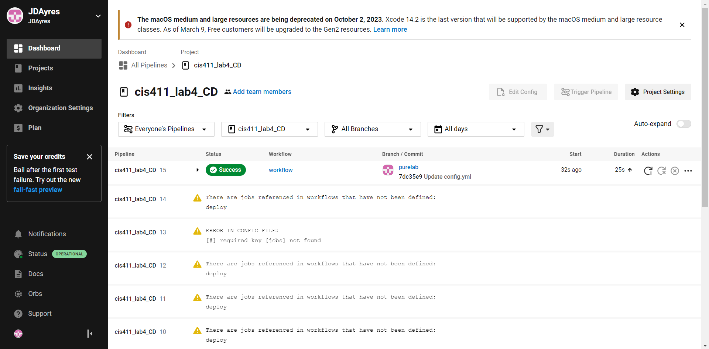

# Lab Report: UX/UI
___
**Course:** CIS 411, Spring 2021 <br> 
**Instructor(s):** [Trevor Bunch](https://github.com/trevordbunch)  <br>
**Name:** Justin Ayres <br>
**GitHub Handle:** JDAyres<br>
**Repository:** https://github.com/JDAyres/cis411_lab4_CD <br> 
**Collaborators:** Batman works alone...
___

# Required Content

- [x] Generate a markdown file in the labreports directory named LAB_[GITHUB HANDLE].md. Write your lab report there.
- [X] Create the directory ```./circleci``` and the file ```.circleci/config.yml``` in your project and push that change to your GitHub repository.
- [x] Create the file ```Dockerfile``` in the root of your project and include the contents of the file as described in the instructions. Push that change to your GitHub repository.
- [x] Write the URL of your app hosted on Heroku or other Cloud Provider here: [https://cis411lab4-jdayres-srn5x.ondigitalocean.app/graphql](https://cis411lab4-jdayres-srn5x.ondigitalocean.app/graphql)
- [x] Embed _using markdown_ a screenshot of your successful deployed application to DigitalOcean.  
 
- [x] Embed _using markdown_ a screenshot of your successful build and deployment to DigitalOcean of your project (with the circleci interface).  
 
- [x] Answer the **4** questions below.
- [x] Submit a Pull Request to cis411_lab4_CD and provide the URL of that Pull Request in Canvas as your URL submission.

## Questions
1. Why would a containerized version of an application be beneficial if you can run the application locally already?
> There are a few reasons why a containerized version of an application would be more beneficial than a locally run application: <br>
> * Containers encapsulate all dependencies and configurations, ensuring a consistent environment across different stages of the development pipeline and between different team members.
> * Containers are lightweight and start up faster than traditional virtual machines, making them ideal for scaling and deploying applications quickly.
> * They enable easy deployment on various platforms, as long as the platform supports container technology (e.g., Kubernetes, AWS ECS, Google Kubernetes Engine).
> * Containers help in implementing microservices architecture, which can improve application maintainability and scalability.
2. If we have the ability to publish directory to DigitalOcean, why involve a CI solution like CircleCI? What benefit does it provide?
> There are a few reasons as to why we should involve a CI solution like CircleCI even when we have the ability to publish a directory to DigitalOcean:
> * CircleCI tests your code before deployment with automated testing, which helps reduce risk of sending out broken code to consumers.
> * CircleCI allows you to build and test multiple branches, commits, and pull requests concurrently, this can help speed up the development process and improve resource utilization.
> * CircleCI lets you integrate with a wide range of tools and services, which enables you to automate additional tasks such as notifications, artifact storage, and performance monitoring.
> * CircleCI allows you to create custom workflows that define the steps, dependencies, and conditions for your build and deployment process. This flexibility allows you to tailor the CI/CD process to your project's specific needs.
3. Why would you use a container technology over a virtual machine(VM)?
> There are a number of advantages to using containers over virtual machines, here are some:
> * Resource efficiency: Containers share the host OS kernel and utilize resources more efficiently than VMs, which run a full OS stack for each instance.
> * Startup speed: Containers start up faster than VMs, as they don't require booting an entire OS.
> * Portability: Containers encapsulate dependencies, making it easy to deploy applications consistently across different environments.
> * Easier management and orchestration: Container orchestration tools like Kubernetes make it easier to manage, scale, and maintain containerized applications compared to VM-based deployments.
4. What are some alternatives to Docker for containerized deployments?
> * Podman, is a daemonless container engine for developing, managing, and running OCI Containers on Linux systems.
> * rkt (also known as Rocket), is a security-minded, standards-based container engine developed by CoreOS, now an archived project.
> * LXD, A system container manager that offers a VM-like experience with the performance and resource efficiency of containers.
> * OpenVZ, is a container-based virtualization solution for Linux, focused on running multiple, isolated Linux instances on a single host.
> * Singularity, A container platform designed for use in high-performance computing and enterprise performance computing environments, with a focus on security and reproducibility.