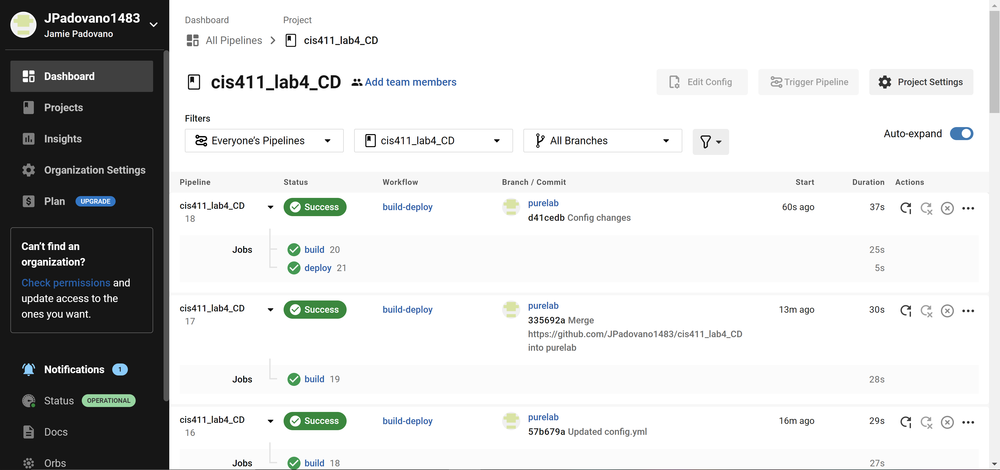
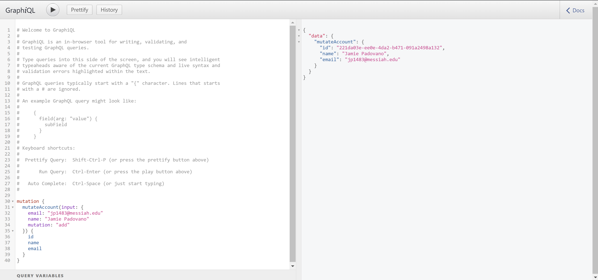

# Lab Report: UX/UI
___
**Course:** CIS 411, Spring 2021  
**Instructor(s):** [Trevor Bunch](https://github.com/trevordbunch)  
**Name:** Jamie Padovano
**GitHub Handle:** JPadovano1483
**Repository:** https://github.com/JPadovano1483/cis411_lab4_CD
___

# Required Content

- [x] Generate a markdown file in the labreports directoy named LAB_[GITHUB HANDLE].md. Write your lab report there.
- [x] Create the directory ```./circleci``` and the file ```.circleci/config.yml``` in your project and push that change to your GitHub repository.
- [x] Create the file ```Dockerfile``` in the root of your project and include the contents of the file as described in the instructions. Push that change to your GitHub repository.
- [x] Embed _using markdown_ a screenshot of your successful build and deployment to Heroku of your project (with the circleci interface).  
> 
- [x] Write the URL of your running Heroku app here (and leave the deployment up so that I can test it):  
> [https://cis411lab4-jpadovano1483.herokuapp.com/graphql](https://cis411lab4-jpadovano1483.herokuapp.com/graphql)  
> 
- [x] Answer the **4** questions below.
- [x] Submit a Pull Request to cis411_lab4_CD and provide the URL of that Pull Request in Canvas as your URL submission.

## Questions
1. Why would a containerized version of an application be beneficial if you can run the application locally already?
> A containerized version of an application allows for better collaboration that if it were to be run locally. A containerized environment is consistent across different development environments. All members of the development team are working in this same environment. 
2. If we have the ability to publish directory to Heroku, why involve a CI solution like CircleCI? What benefit does it provide?
> CircleCI tests your code before it is deployed. This allows you to fix any errors you may have before you deploy your app. This saves a lot of time and headache in the end since you don't need to constantly be redeploying your app every time there is an issue.
3. Why would you use a container technology over a virtual machine(VM)?
> A container uses much fewer resources which makes if faster, more efficient, and overall easier to manage. VMs virtualize an entire machine down to the hardware layers while containers only virtualize software layers above the operating system level.
4. What are some alternatives to Docker for containerized deployments?
> Some of the top alternatives to Docker are Podman, OpenVZ, Kubernetes, LXC, and Microsoft Azure Container Registry.