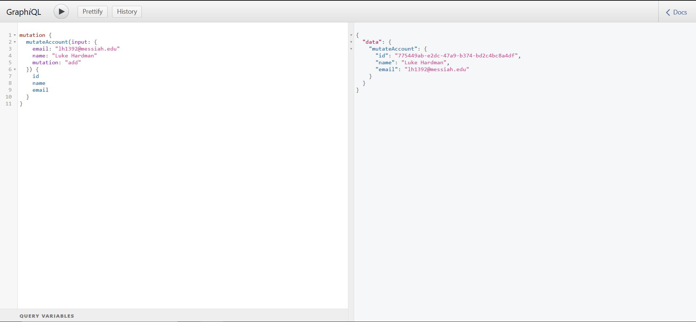
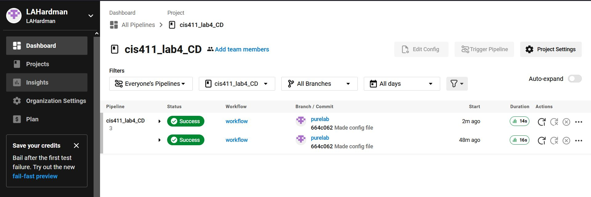

# Lab Report: UX/UI
___
**Course:** CIS 411, Spring 2021  
**Instructor(s):** [Trevor Bunch](https://github.com/trevordbunch)  
**Name:** Luke Hardman
**GitHub Handle:** LAHardman 
**Repository:** [Forked Repository](https://github.com/LAHardman/cis411_lab4_CD/tree/heroku)
**Collaborators:** 
___

# Required Content

- [X] Generate a markdown file in the labreports directory named LAB_[GITHUB HANDLE].md. Write your lab report there.
- [X] Create the directory ```./circleci``` and the file ```.circleci/config.yml``` in your project and push that change to your GitHub repository.
- [X] Create the file ```Dockerfile``` in the root of your project and include the contents of the file as described in the instructions. Push that change to your GitHub repository.
- [X] Write the URL of your app hosted on Heroku or other Cloud Provider here:  
> Example: [http://lahardman.herokuapp.com/graphql](http://lahardman.herokuapp.com/graphql)
- [X] Embed _using markdown_ a screenshot of your successful deployed application to Heroku.  
> Example: 
- [X] Embed _using markdown_ a screenshot of your successful build and deployment to Heroku of your project (with the circleci interface).  
> 
- [X] Answer the **4** questions below.
- [X] Submit a Pull Request to cis411_lab4_CD and provide the URL of that Pull Request in Canvas as your URL submission.

## Questions
1. Why would a containerized version of an application be beneficial if you can run the application locally already?
> Containerization provides portability, consistency, scalability, and security, ensuring the application runs consistently across different environments regardless of the underlying operating system.

2. If we have the ability to publish directory to a cloud service provider like Heroku, why involve a CI solution like CircleCI? What benefit does it provide?
> CircleCI automates the build, test, and deployment process, ensuring your application is always up-to-date and running smoothly. It also helps identify potential issues in the code before deployment, minimizing the risk of downtime or unexpected behavior.

3. Why would you use a container technology over a virtual machine(VM)?
> Containers are more resource-efficient, portable, and scalable than VMs. They share the host's operating system kernel, making them lighter and faster to deploy. This allows you to run multiple containers on a single machine, saving resources and simplifying application deployment and management.

4. What are some alternatives to Docker for containerized deployments?
> Alternatives to Docker include Kubernetes, LXC/LXD, Podman, Singularity, and Containerd. Each platform has unique features and benefits, so consider your specific requirements when selecting a containerization solution.