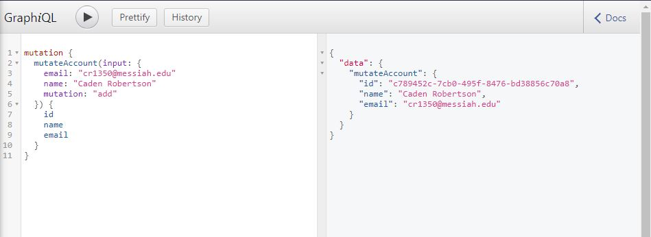

# Lab Report: UX/UI
___
**Course:** CIS 411, Spring 2021  
**Instructor(s):** [Trevor Bunch](https://github.com/trevordbunch)  
**Name:** Caden Robertson  
**GitHub Handle:** NedacNostrebor 
**Repository:** [Your Forked Repository](https://github.com/NedacNostrebor/cis411_lab4_CD)
**Collaborators:** 
___

# Required Content

- [x] Generate a markdown file in the labreports directoy named LAB_[GITHUB HANDLE].md. Write your lab report there.
- [x] Create the directory ```./circleci``` and the file ```.circleci/config.yml``` in your project and push that change to your GitHub repository.
- [x] Create the file ```Dockerfile``` in the root of your project and include the contents of the file as described in the instructions. Push that change to your GitHub repository.
- [x] Write the URL of your running Heroku app here:  
> [https://cis411lab4-nedacnostrebor.herokuapp.com/graphql](https://cis411lab4-nedacnostrebor.herokuapp.com/graphql)
- [x] Embed _using markdown_ a screenshot of your successful build and deployment to Heroku of your project.  
> 
- [x] Answer the **4** questions below.
- [x] Submit a Pull Request to cis411_lab4_CD and provide the URL of that Pull Request in Canvas as your URL submission.

## Questions
1. Why would a containerized version of an application be beneficial if you can run the application locally already?
> They allow you to be able to run it from a predictable environment that is isolated from other applications which makes it consistent across different development environments.
2. If we have the ability to publish directory to Heroku, why involve a CI solution like CircleCI? What benefit does it provide?
> Heroku doesn't test if that stuff you are putting out is compatible with what you have while CircleCI does.
3. Why would you use a container technology over a virtual machine(VM)?
> Containers are much more resource intensive to run and are easier to move across multiple environments.
4. What are some alternatives to Docker for containerized deployments?
> rkt, LXD, Windows Containers