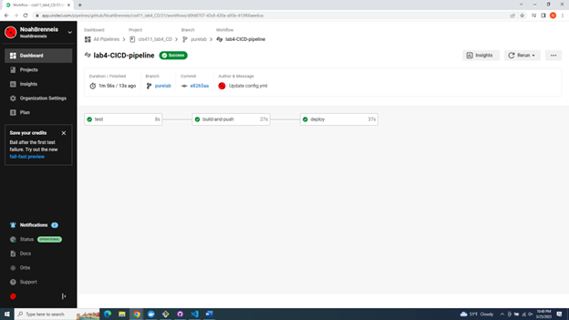

# Lab Report: UX/UI
___
**Course:** CIS 411, Spring 2021  
**Instructor(s):** [Trevor Bunch](https://github.com/trevordbunch)  
**Name:** Noah Brenneis  
**GitHub Handle:** NoahBrenneis  
**Repository:** github.com/NoahBrenneis/cis411_lab4_CD  
**Collaborators:** 
___

# Required Content

- [x] Generate a markdown file in the labreports directory named LAB_[GITHUB HANDLE].md. Write your lab report there.
- [x] Create the directory ```./circleci``` and the file ```.circleci/config.yml``` in your project and push that change to your GitHub repository.
- [x] Create the file ```Dockerfile``` in the root of your project and include the contents of the file as described in the instructions. Push that change to your GitHub repository.
- [x] Write the URL of your app hosted on Heroku or other Cloud Provider here:  
    [My Link](http://ec2-52-91-106-210.compute-1.amazonaws.com:4000/graphql)
- [x] Embed _using markdown_ a screenshot of your successful deployed application to Heroku.  
    
- [x] Embed _using markdown_ a screenshot of your successful build and deployment to Heroku of your project (with the circleci interface).  
    
- [x] Answer the **4** questions below.
- [x] Submit a Pull Request to cis411_lab4_CD and provide the URL of that Pull Request in Canvas as your URL submission.

## Questions
1. Why would a containerized version of an application be beneficial if you can run the application locally already?
> Because everyone has a different computer with different settings, using a container allows you to remove any extra variables and make a given project work regardless of hardware.
2. If we have the ability to publish directory to Heroku, why involve a CI solution like CircleCI? What benefit does it provide?
> Using CircleCI allows us to check whether or not our code works without having to test it on the cloud. It also allows us to instantly deploy our application as soon as we make a change to it on GitHub, without having to manually start it every time.
3. Why would you use a container technology over a virtual machine(VM)?
> Virtual Machines can take up large amounts of space, and often come with a number of features that are unecessary for smaller web applications. A container, meanwhile, does not contain this extra bloat and only has what you need for the app to function.
4. What are some alternatives to Docker for containerized deployments?
> Some alternative container platforms to Docker include AWS Fargate, Google Kubernetes Engine, and LXC.