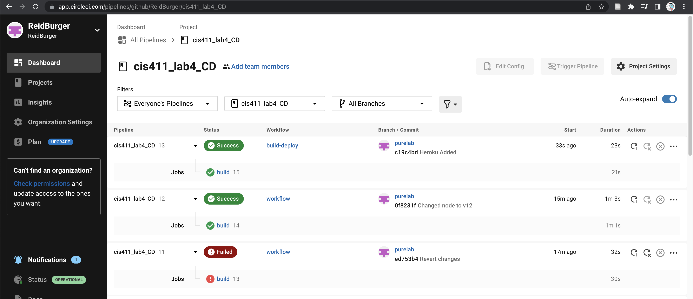
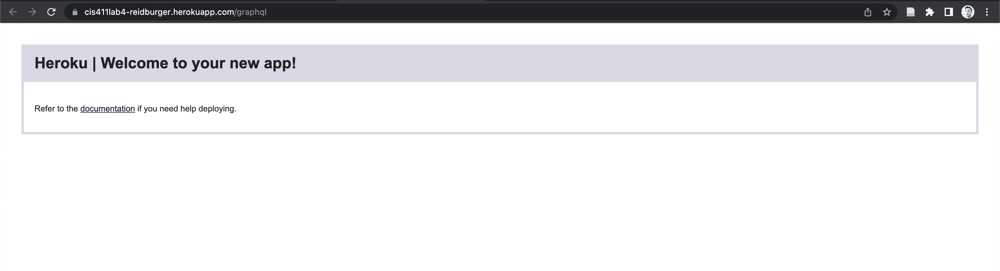

# Lab Report: UX/UI
___
**Course:** CIS 411, Spring 2021  
**Instructor(s):** [Trevor Bunch](https://github.com/trevordbunch)  
**Name:** Reid Burger   
**GitHub Handle:** [Reid Burger](https://github.com/ReidBurger)   
**Repository:** [My Forked Repository](https://github.com/ReidBurger/cis411_lab4_CD)   
**Collaborators:** 
___

# Required Content

- [x] Generate a markdown file in the labreports directoy named LAB_[GITHUB HANDLE].md. Write your lab report there.
- [x] Create the directory ```./circleci``` and the file ```.circleci/config.yml``` in your project and push that change to your GitHub repository.
- [x] Create the file ```Dockerfile``` in the root of your project and include the contents of the file as described in the instructions. Push that change to your GitHub repository.
- [x] Embed _using markdown_ a screenshot of your successful build and deployment to Heroku of your project (with the circleci interface).  
> 
- [x] Write the URL of your running Heroku app here (and leave the deployment up so that I can test it):  
- NOTE: I was not able to get the CircleCI working on Heroku. I sent a message on Slack, but I have not received any help as to how to solve it. 
> [https://cis411lab4-reidburger.herokuapp.com/graphql](https://cis411lab4-reidburger.herokuapp.com/graphql)  
> 
- [x] Answer the **4** questions below.
- [x] Submit a Pull Request to cis411_lab4_CD and provide the URL of that Pull Request in Canvas as your URL submission.

## Questions
1. Why would a containerized version of an application be beneficial if you can run the application locally already?
> Having a containerized version of an app is useful because it allows you to separate the infrastructure from the app, meaning that you can deploy code much faster and safer. Also, having a containerized environment ensures that all members of a dev team are working in the same environment regardless of the host.
2. If we have the ability to publish directory to Heroku, why involve a CI solution like CircleCI? What benefit does it provide?
> CircleCI provides the ability to make sure changes are valid and that the environment can actually be properly run and deployed. Without it, we might miss some critical errors that might otherwise be looked over or avoided by bypassing it and going straight to Heroku.
3. Why would you use a container technology over a virtual machine(VM)?
> Container technology uses less resources than virtual machine technology, and it's overall more efficient and consistent across different hosts.
4. What are some alternatives to Docker for containerized deployments?
> From my 15 minutes of research, the only alternative I've found to Docker is Kubernetes, though CircleCI keeps coming up as an option as well even though I no it's not a container deployment service.