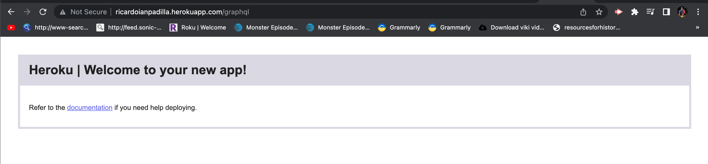
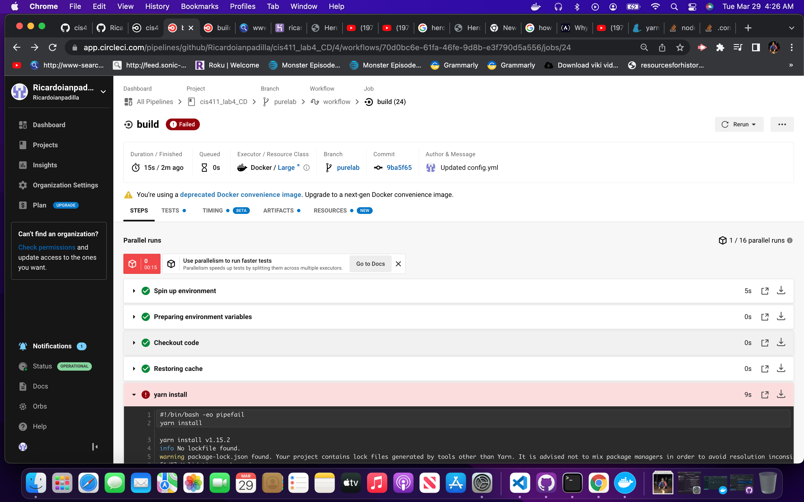
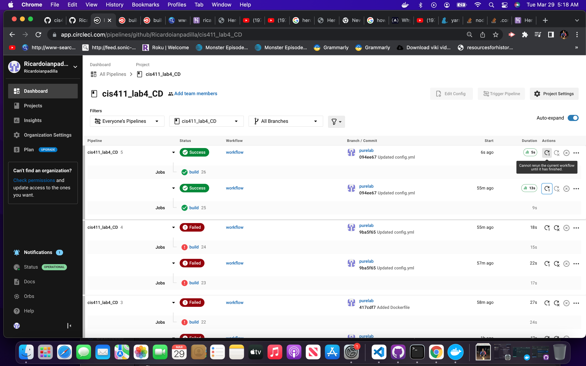

# Lab Report: UX/UI
___
**Course:** CIS 411, Spring 2021  
**Instructor(s):** [Trevor Bunch](https://github.com/trevordbunch)  
**Name:** Ricardo Padilla
**GitHub Handle:** Ricardoianpadilla 
**Repository:** https://github.com/Ricardoianpadilla/cis411_lab4_CD
**Collaborators:** None
___

# Required Content

- [x] Generate a markdown file in the labreports directoy named LAB_[GITHUB HANDLE].md. Write your lab report there.
- [x] Create the directory ```./circleci``` and the file ```.circleci/config.yml``` in your project and push that change to your GitHub repository.
- [x] Create the file ```Dockerfile``` in the root of your project and include the contents of the file as described in the instructions. Push that change to your GitHub repository.
- [x] Screenshot of your successful build and deployment to Heroku of your project (with the circleci interface).  
> Successful Build: 
> Fail in CI: 
An attempt to install 5 diffrent version of node was made with 10v 11v and other versons within 11v (11.2,11.4...). in addition commands were attempted to ignore the version of node but no solution was found.
> Fail in CI: 
This is the second test which was a success.


- [x] Write the URL of your running Heroku app:  
> Link to Heroku Successful Build: [http://ricardoianpadilla.herokuapp.com/graphql](http://ricardoianpadilla.herokuapp.com/graphql)
  
> 

- [ ] Answer the **4** questions below.
- [ ] Submit a Pull Request to cis411_lab4_CD and provide the URL of that Pull Request in Canvas as your URL submission.

## Questions
1. Why would a containerized version of an application be beneficial if you can run the application locally already?
> Respond here...
2. If we have the ability to publish directory to Heroku, why involve a CI solution like CircleCI? What benefit does it provide?
> Respond here...
3. Why would you use a container technology over a virtual machine(VM)?
> Respond here...
4. What are some alternatives to Docker for containerized deployments?
> Respond here...