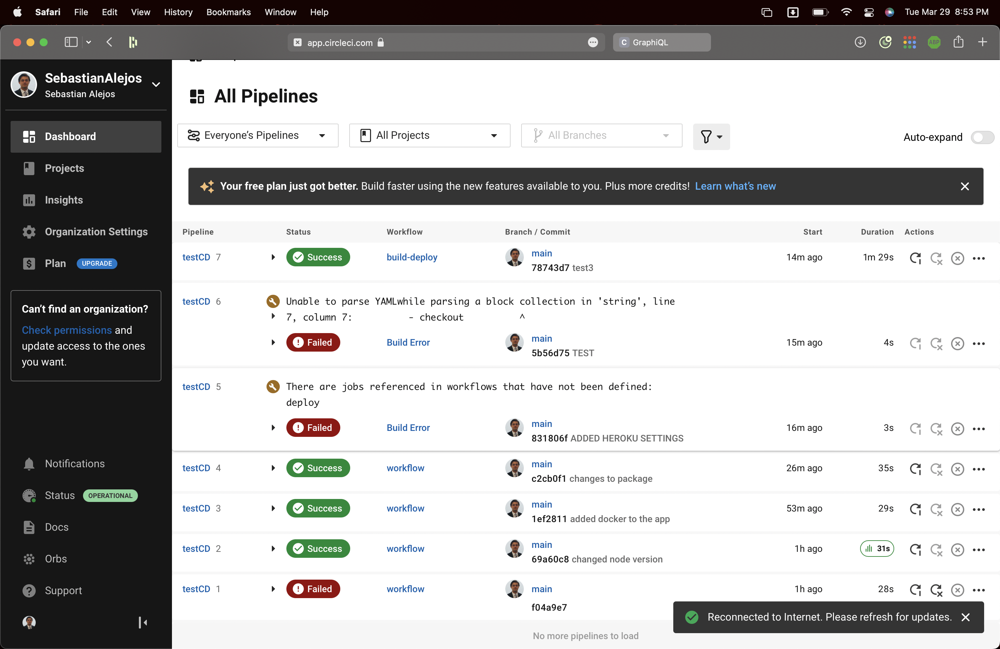
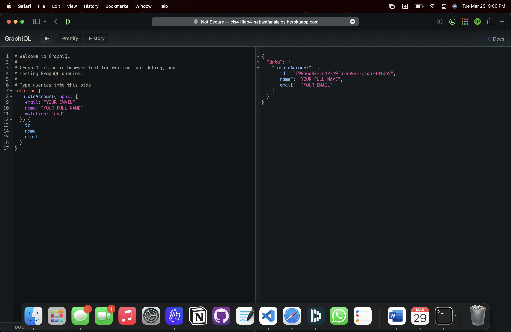

# Lab Report: UX/UI

___
**Course:** CIS 411, Spring 2021  
**Instructor(s):** [Trevor Bunch](https://github.com/trevordbunch)  
**Name:** Sebastian Alejos
**GitHub Handle:** SebastianAlejos
**Repository:** <https://github.com/SebastianAlejos/cis411_lab4_CD>
**Collaborators:**
___

# Required Content

- [x] Generate a markdown file in the labreports directoy named LAB_[GITHUB HANDLE].md. Write your lab report there.
- [x] Create the directory ```./circleci``` and the file ```.circleci/config.yml``` in your project and push that change to your GitHub repository.
- [x] Create the file ```Dockerfile``` in the root of your project and include the contents of the file as described in the instructions. Push that change to your GitHub repository.
- [x] Embed _using markdown_ a screenshot of your successful build and deployment to Heroku of your project (with the circleci interface).  

> Example: 

- [x] Write the URL of your running Heroku app here (and leave the deployment up so that I can test it):  

[http://cis411lab4-sebastianalejos.herokuapp.com/graphql](http://cis411lab4-sebastianalejos.herokuapp.com/graphql)  
> 

- [ ] Answer the **4** questions below.
- [ ] Submit a Pull Request to cis411_lab4_CD and provide the URL of that Pull Request in Canvas as your URL submission.

## Questions

1. Why would a containerized version of an application be beneficial if you can run the application locally already?

> It creates a consistent flow of code that runs automatically as you develop. The ability to run tests as you push code lets you figure out faster why it is not working.

2.If we have the ability to publish directory to Heroku, why involve a CI solution like CircleCI? What benefit does it provide?

>It provides a way to integrate our repository in a way that it gets tested before deployment.

3.Why would you use a container technology over a virtual machine(VM)?

> Because this allows you to simulate a real environment without a lot of resources and its faster.

4.What are some alternatives to Docker for containerized deployments?

> WindowsContainers, rkt and LinuxVserver

Note: this lab was completed in: <https://github.com/SebastianAlejos/testCD> due to issues with CircleCi and later copied to this repo.