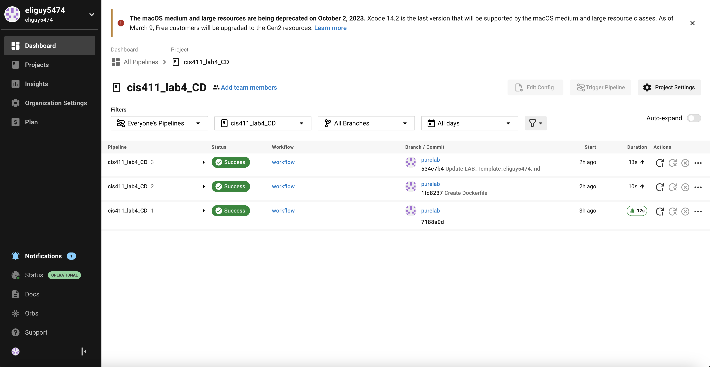
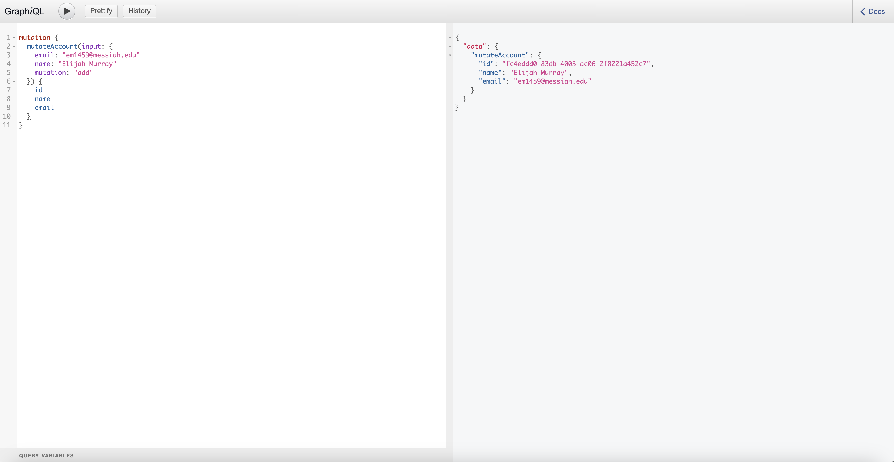
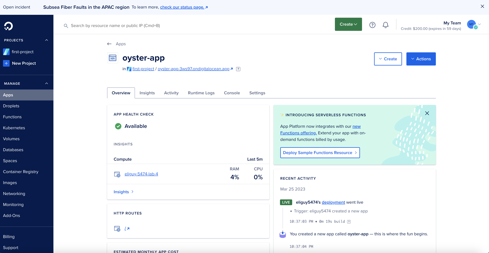

# Lab Report: UX/UI
___
**Course:** CIS 411, Spring 2021  
**Instructor(s):** [Trevor Bunch](https://github.com/trevordbunch)  
**Name:** Elijah Murray  
**GitHub Handle:** eliguy5474  
**Repository:** https://github.com/eliguy5474/cis411_lab4_CD  
**Collaborators:** 
___

# Required Content

- [Y] Generate a markdown file in the labreports directory named LAB_[GITHUB HANDLE].md. Write your lab report there.
- [Y] Create the directory ```./circleci``` and the file ```.circleci/config.yml``` in your project and push that change to your GitHub repository.
- [Y] Create the file ```Dockerfile``` in the root of your project and include the contents of the file as described in the instructions. Push that change to your GitHub repository.
- [Y] Write the URL of your app hosted on Heroku or other Cloud Provider here:  
> Example: [http://cis411lab2-trevordbunch.herokuapp.com/graphql]
> (https://oyster-app-3ws97.ondigitalocean.app/graphql?)
- [Y] Embed _using markdown_ a screenshot of your successful deployed application to Heroku.  
> Example: 
- [Y] Embed _using markdown_ a screenshot of your successful build and deployment to Heroku of your project (with the circleci interface).  
> Example: 
> 
- [Y] Answer the **4** questions below.
- [Y] Submit a Pull Request to cis411_lab4_CD and provide the URL of that Pull Request in Canvas as your URL submission.

## Questions
1. Why would a containerized version of an application be beneficial if you can run the application locally already?
> Application containerization has a number of benefits over local hosting, including portability, consistency, scalability, and security. Modern cloud-native apps are ideal for containers because they offer a self-contained environment that can be quickly transferred and scaled across many platforms and environments.
2. If we have the ability to publish directory to Heroku, why involve a CI solution like CircleCI? What benefit does it provide?
> While CircleCI offers advantages like automation, scalability, and integration that can assist streamline the build-test-deploy process, Heroku's directory publishing option is more practical. Developers may now concentrate more on coding and less on overseeing the deployment process thanks to this.
3. Why would you use a container technology over a virtual machine(VM)?
> Because they are more effective, portable, scalable, and consistent than virtual machines, containers are a preferable choice. Containers use the same operating system kernel as the host, which makes them more faster and lighter to deploy than virtual machines, which require a full operating system to operate each instance. This frees up time and resources by allowing you to run several containers on a single computer rather than having to install an OS for each one separately.
4. What are some alternatives to Docker for containerized deployments?
> Popular containerization systems like Kubernetes, LXC/LXD, rkt, and CRI-O provide advantages including higher-level orchestration, more lightweight containerization, and improved security.