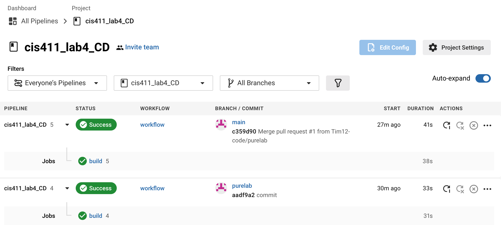

# Lab Report: UX/UI
___
**Course:** CIS 411, Spring 2021  
**Instructor(s):** [Trevor Bunch](https://github.com/trevordbunch)  
**Name:** Timothy Diana  
**GitHub Handle:** Tim12-code 
**Repository:** https://github.com/Tim12-code/cis411_lab4_CD.git
**Collaborators:** 
___

# Required Content

- [ ] Write the URL of your running Heroku app here: [http://cis411lab4-tim12-code.herokuapp.com/graphql](http://cis411lab4-tim12-code.herokuapp.com/graphql)
- [ ] Embed _using markdown_ a screenshot of your successful build and deployment to Heroku of your project. 

## Questions
1. Why would a containerized version of an application be beneficial if you can run the application locally already?
- if you run it on the container you can access it in other places than just your local computer.
2. If we have the ability to publish directory to Heroku, why involve a CI solution like CircleCI? What benefit does it provide?
- Heroku doesn't check for errors, CircleCI runs it and analyzes it for errors.
3. Why would you use a container technology over a virtual machine(VM)?
- Containers provide a way to virtualize an OS so multiple workloads can run on a single OS instance.
4. What are some alternatives to Docker for containerized deployments?
- virtual box, vagrant, wox, and rancher.