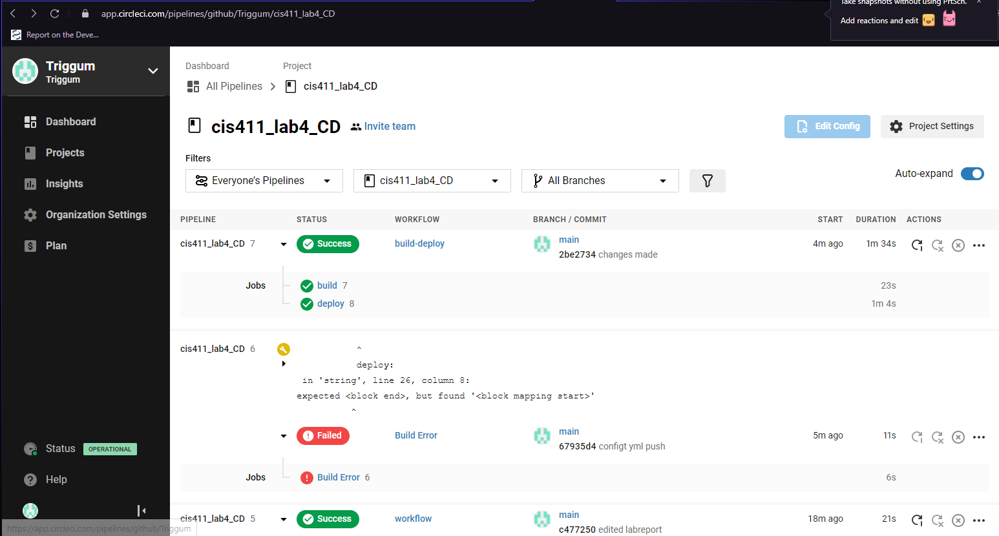

# Lab Report: UX/UI
___
**Course:** CIS 411, Spring 2021  
**Instructor(s):** [Trevor Bunch](https://github.com/trevordbunch)  
**Name:** Bryan Chang  
**GitHub Handle:** Triggum 
**Repository:** [Your Forked Repository](https://github.com/Triggum/cis411_lab4_CD.git)  
**Collaborators:** 
@RomanSearle
___

# Required Content

- [/] Generate a markdown file in the labreports directory named LAB_[GITHUB HANDLE].md. Write your lab report there.
- [/] Create the directory ```./circleci``` and the file ```.circleci/config.yml``` in your project and push that change to your GitHub repository.
- [/] Create the file ```Dockerfile``` in the root of your project and include the contents of the file as described in the instructions. Push that change to your GitHub repository.
- [/] Write the URL of your running Heroku app here: [https://cis411lab4-triggum.herokuapp.com/graphql](https://cis411lab4-triggum.herokuapp.com/graphql)
- [/] Embed _using markdown_ a screenshot of your successful build and deployment to Heroku of your project.  

- [/] Answer the **4** questions below.
- [/] Submit a Pull Request to cis411_lab4_CD and provide the URL of that Pull Request in Canvas as your URL submission.

## Questions
1. Why would a containerized version of an application be beneficial if you can run the application locally already?
> It lowers the chance of a bug affecting another portion of a code. It also allows for a developer to work on the code without affecting the live version.
2. If we have the ability to publish directory to Heroku, why involve a CI solution like CircleCI? What benefit does it provide?
> Deploying to CircleCI would allow for continuous delivery through the automation of the process which allows for faster development along with automatically running the tests that the code must pass before pushing it to Heroku. 
3. Why would you use a container technology over a virtual machine(VM)?
> A container technology are smaller and faster than virtual machines because they do not require the inclusion of a guest OS while also allowing access to all the features and resources of the OS.   
> Source: www.ibm.com/cloud/blog/containers-vs-vms
4. What are some alternatives to Docker for containerized deployments?
> A few alternatives to docker for containerized deployments are:
>Kubernetes, LXC and rkt.

>Source: https://stackshare.io/docker/alternatives