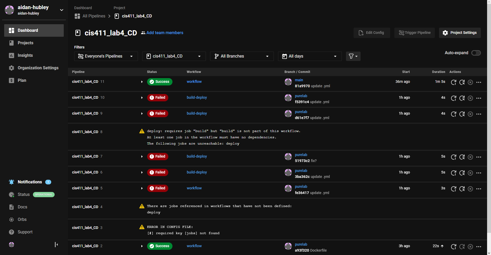
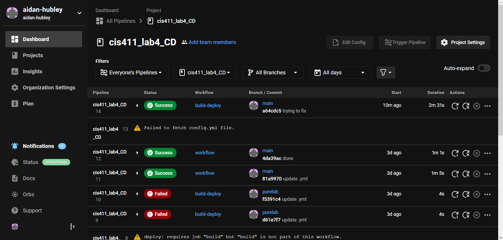

# Lab Report: UX/UI
___
**Course:** CIS 411, Spring 2021  
**Instructor(s):** [Trevor Bunch](https://github.com/trevordbunch)  
**Name:** Aidan Hubley  
**GitHub Handle:** aidan-hubley  
**Repository:** [Forked Repository](https://github.com/aidan-hubley/cis411_lab4_CD)  
**Collaborators:** ChatGPT - JDAyers - Statmosphere - jp1579 - 02NRA - rt1252
___

# Required Content

- [X] Generate a markdown file in the labreports directory named LAB_[GITHUB HANDLE].md. Write your lab report there.
- [X] Create the directory ```./circleci``` and the file ```.circleci/config.yml``` in your project and push that change to your GitHub repository.
- [X] Create the file ```Dockerfile``` in the root of your project and include the contents of the file as described in the instructions. Push that change to your GitHub repository.
- [X] Write the URL of your app hosted on Heroku or other Cloud Provider here:  
> Example: [https://cis411lab4-aidan-hubley-lv2ul.ondigitalocean.app/graphql](https://cis411lab4-aidan-hubley-lv2ul.ondigitalocean.app/graphql)
- [X] Embed _using markdown_ a screenshot of your successful deployed application to Heroku.  
> 
- [X] Embed _using markdown_ a screenshot of your successful build and deployment to Digital Ocean of your project (with the circleci interface).  
> 
- [X] Answer the **4** questions below.
- [X] Submit a Pull Request to cis411_lab4_CD and provide the URL of that Pull Request in Canvas as your URL submission.

- Fixed Build:

- Not sure how I managed to use workflow but here is the build-deploy success

## Questions
1. Why would a containerized version of an application be beneficial if you can run the application locally already?
> Containerizing an application offers several advantages over hosting it locally, such as portability, consistency, scalability, and security. Containers provide a self-contained environment that can be easily moved and scaled across various platforms and environments, making them perfect for modern cloud-native applications.
2. If we have the ability to publish directory to Heroku, why involve a CI solution like CircleCI? What benefit does it provide?
> While Heroku's directory publishing feature is convenient, CircleCI offers benefits such as automation, scalability, and integration that can help streamline the build-test-deploy process. This allows developers to focus more on coding and less on managing the deployment process.
3. Why would you use a container technology over a virtual machine(VM)?
> Containers are a better option than virtual machines because they are more efficient, portable, scalable, and consistent. Unlike virtual machines that need a complete operating system to run each instance, containers share the same OS kernel as the host, making them much faster and lightweight to deploy. This means you can run multiple containers on a single machine without having to install a separate OS for each one, which saves time and resources.
4. What are some alternatives to Docker for containerized deployments?
> Kubernetes, LXC/LXD, rkt, and CRI-O are popular containerization technologies that offer different benefits such as higher-level orchestration, more lightweight containerization, and enhanced security.
### Soucres:
1. [https://chat.openai.com/chat](https://chat.openai.com/chat)
2. [https://docs.docker.com/get-started/overview/](https://docs.docker.com/get-started/overview/)
2. [https://circleci.com/](https://circleci.com/)
3. [https://kubernetes.io/](https://kubernetes.io/)
4. [https://www.redhat.com/en/topics/virtualization/containers-vs-vms](https://www.redhat.com/en/topics/virtualization/containers-vs-vms)
5. [https://www.docker.com/resources/what-container](https://www.docker.com/resources/what-container)