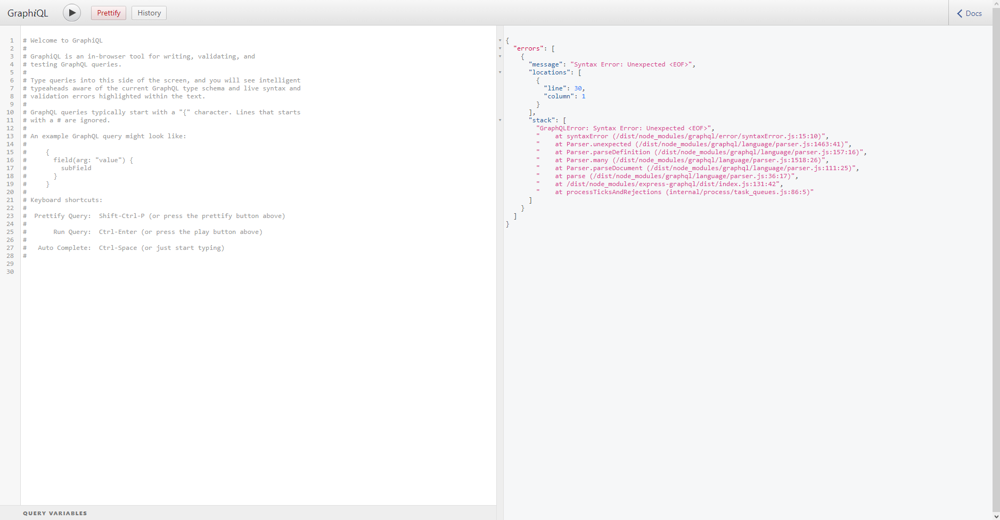
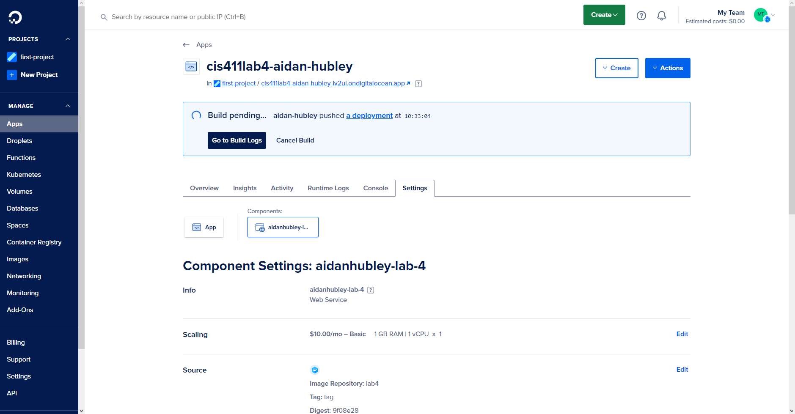

# Lab Report: UX/UI
___
**Course:** CIS 411, Spring 2021  
**Instructor(s):** [Trevor Bunch](https://github.com/trevordbunch)  
**Name:** Aidan Hubley  
**GitHub Handle:** aidan-hubley  
**Repository:** [Forked Repository](https://github.com/aidan-hubley/cis411_lab4_CD)  
**Collaborators:** ChatGPT - JDAyers - Statmosphere - jp1579 - 02NRA - rt1252
___

# Required Content

- [X] Generate a markdown file in the labreports directory named LAB_[GITHUB HANDLE].md. Write your lab report there.
- [X] Create the directory ```./circleci``` and the file ```.circleci/config.yml``` in your project and push that change to your GitHub repository.
- [X] Create the file ```Dockerfile``` in the root of your project and include the contents of the file as described in the instructions. Push that change to your GitHub repository.
- [X] Write the URL of your app hosted on Heroku or other Cloud Provider here:  
> Example: [https://cis411lab4-aidan-hubley-lv2ul.ondigitalocean.app/graphql](https://cis411lab4-aidan-hubley-lv2ul.ondigitalocean.app/graphql)
- [X] Embed _using markdown_ a screenshot of your successful deployed application to Heroku.  
> 
- [X] Embed _using markdown_ a screenshot of your successful build and deployment to Digital Ocean of your project (with the circleci interface).  
> 
- [X] Answer the **4** questions below.
- [X] Submit a Pull Request to cis411_lab4_CD and provide the URL of that Pull Request in Canvas as your URL submission.

## Questions
1. Why would a containerized version of an application be beneficial if you can run the application locally already?
> Respond here...
2. If we have the ability to publish directory to Heroku, why involve a CI solution like CircleCI? What benefit does it provide?
> Respond here...
3. Why would you use a container technology over a virtual machine(VM)?
> Respond here...
4. What are some alternatives to Docker for containerized deployments?
> Respond here...