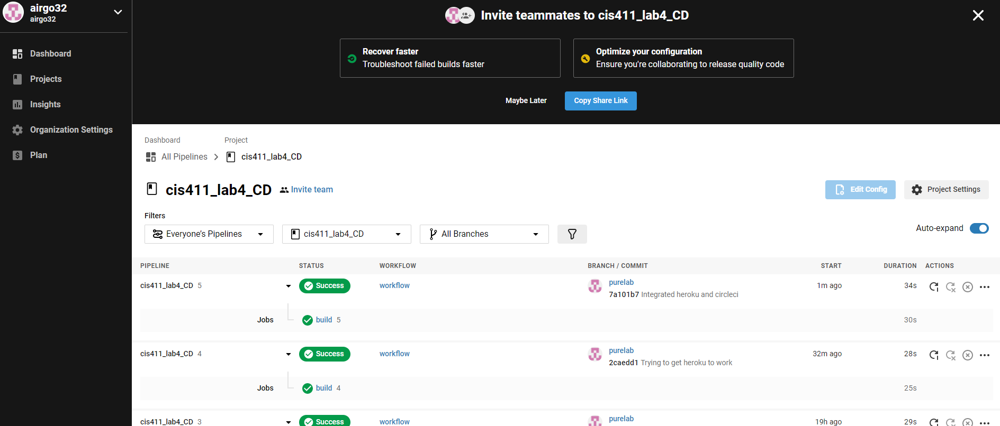

# Lab Report: UX/UI
___
**Course:** CIS 411, Spring 2021  
**Instructor(s):** [Trevor Bunch](https://github.com/trevordbunch)  
**Name:** Your Name  
**GitHub Handle:** Your GitHub Handle  
**Repository:** Your Forked Repository  
**Collaborators:** 
___

# Required Content

- [X] Generate a markdown file in the labreports directoy named LAB_airgo32.md. Write your lab report there.
- [X] Create the directory ```./circleci``` and the file ```.circleci/config.yml``` in your project and push that change to your GitHub repository.
- [X] Create the file ```Dockerfile``` in the root of your project and include the contents of the file as described in the instructions. Push that change to your GitHub repository.
- [X] Write the URL of your running Heroku app here:

[https://cis411lab4-airgo32.herokuapp.com/graphql](https://cis411lab4-airgo32.herokuapp.com/graphql)
- [X] Embed _using markdown_ a screenshot of your successful build and deployment to Heroku of your project.  

     

- [X] Answer the **4** questions below.
- [X] Submit a Pull Request to cis411_lab4_CD and provide the URL of that Pull Request in Canvas as your URL submission.

## Questions
1. Why would a containerized version of an application be beneficial if you can run the application locally already?
> Containerized applications allow you to run the application on different devices and operating systems without having to recompile the app
2. If we have the ability to publish directory to Heroku, why involve a CI solution like CircleCI? What benefit does it provide?
> CircleCI allows us to perform automated tests to see which (if any) parts of the existing codebase were broken by the new features. It can also be customized to have other uses, such as sending out notifications about successes or failures.
3. Why would you use a container technology over a virtual machine(VM)?
> Container technologies are more customizable and use fewer system resources than a VM. The different containers activate only when needed instead of always requiring system resources.
4. What are some alternatives to Docker for containerized deployments?
> Some alternatives to Docker include rkt, Windows Containers, and Linux VServer, among others.