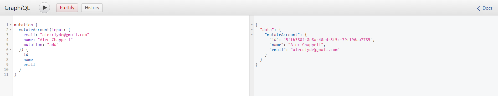

# Lab Report: UX/UI
___
**Course:** CIS 411, Spring 2021  
**Instructor(s):** [Trevor Bunch](https://github.com/trevordbunch)  
**Name:** Alec Chappell  
**GitHub Handle:** [@alecclyde](https://github.com/alecclyde)  
**Repository:** [Alecclyde's forked repository](https://github.com/alecclyde/cis411_lab4_CD)
**Collaborators:** 
___

# Required Content

- [x] Generate a markdown file in the labreports directoy named LAB_[GITHUB HANDLE].md. Write your lab report there.
- [x] Create the directory ```./circleci``` and the file ```.circleci/config.yml``` in your project and push that change to your GitHub repository.
- [x] Create the file ```Dockerfile``` in the root of your project and include the contents of the file as described in the instructions. Push that change to your GitHub repository.
- [x] Write the URL of your running Heroku app here:  

> [http://alecclyde.herokuapp.com/graphql](http://alecclyde.herokuapp.com/graphql)
- [x] Embed _using markdown_ a screenshot of your successful build and deployment to Heroku of your project.  
> 
- [x] Answer the **4** questions below.
- [x] Submit a Pull Request to cis411_lab4_CD and provide the URL of that Pull Request in Canvas as your URL submission.

## Questions
1. Why would a containerized version of an application be beneficial if you can run the application locally already?
> A container allows for all members of the project to run the application without needing to download a whole different host of programs. The container should contain all of the dependencies needed to run the program.
2. If we have the ability to publish directory to Heroku, why involve a CI solution like CircleCI? What benefit does it provide?
> CircleCI is the middle-program that tests code to make sure it is deployable. CircleCI also allows multiple users to push their code before it goes live to Heroku. 
3. Why would you use a container technology over a virtual machine(VM)?
> Containers take up less resources than a virtual machine will. Virtual machines are more dependent and typically also take longer to set up.
4. What are some alternatives to Docker for containerized deployments?
> [LXD](https://linuxcontainers.org/), [rkt](https://www.openshift.com/learn/topics/rkt), and [Apache Mesos](http://mesos.apache.org/) are some alternatives to Docker.