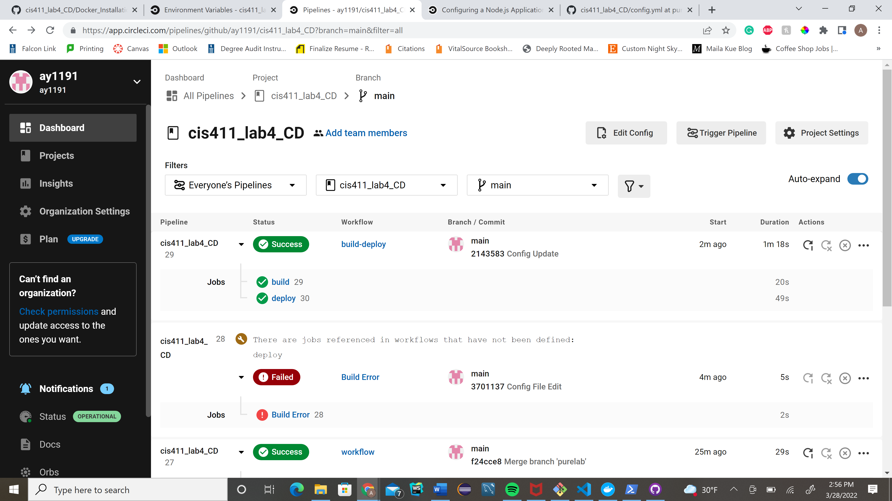
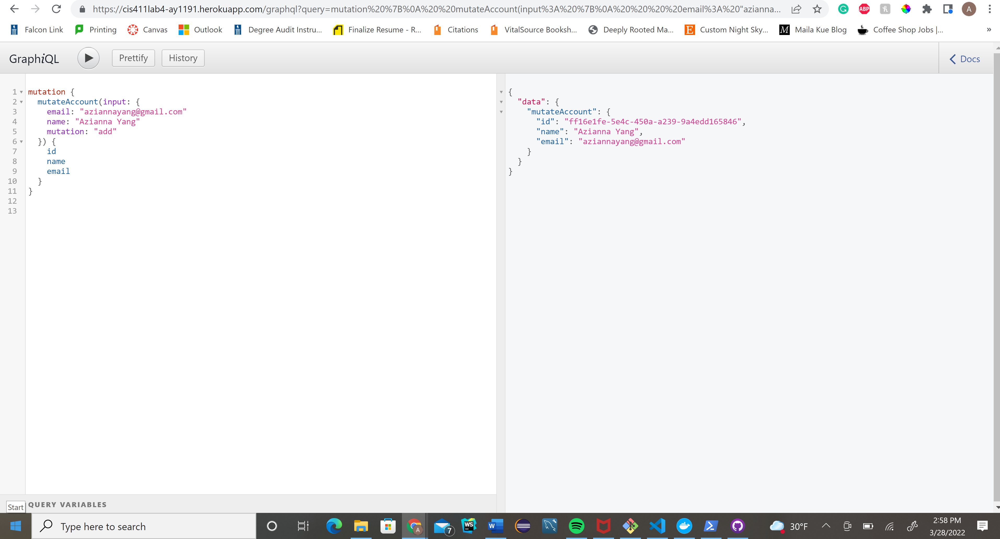

# Lab Report: UX/UI
___
**Course:** CIS 411, Spring 2021  
**Instructor(s):** [Trevor Bunch](https://github.com/trevordbunch)  
**Name:** Azianna Yang 
**GitHub Handle:** ay1191  
**Repository:** Your Forked Repository  
**Collaborators:** 
___

# Required Content

- [x] Generate a markdown file in the labreports directoy named LAB_[GITHUB HANDLE].md. Write your lab report there.
- [x] Create the directory ```./circleci``` and the file ```.circleci/config.yml``` in your project and push that change to your GitHub repository.
- [x] Create the file ```Dockerfile``` in the root of your project and include the contents of the file as described in the instructions. Push that change to your GitHub repository.
- [x] Embed _using markdown_ a screenshot of your successful build and deployment to Heroku of your project (with the circleci interface).  
> Example: 
- [x] Write the URL of your running Heroku app here (and leave the deployment up so that I can test it):  
> Example: [https://cis411lab4-ay1191.herokuapp.com/graphql](https://cis411lab4-ay1191.herokuapp.com/graphql)  
> 
- [x] Answer the **4** questions below.
- [x] Submit a Pull Request to cis411_lab4_CD and provide the URL of that Pull Request in Canvas as your URL submission.

## Questions
1. Why would a containerized version of an application be beneficial if you can run the application locally already?
> A container allows every member working on the project to run the application without needing to download different programs. This ensures that the application runs the same across all devices.
2. If we have the ability to publish directory to Heroku, why involve a CI solution like CircleCI? What benefit does it provide?
> Involving a CI solution like CircleCI inscreases development speed while ensuring the quality of code deployed is not compromised. It ensures that failed builds are not pushed. It allows developers to continually commit code in small increments, multiple times a day, which is then build and tested before it is merged with the shared repository. 
3. Why would you use a container technology over a virtual machine(VM)?
> Containers are more lightweight and more portable than VMs. They require fewer IT resources to deploy, run, and manage. Essentially they take up less resources than a virtual machine.
4. What are some alternatives to Docker for containerized deployments?
> Alternatives to Docker for containerized deployments are LXC (Linux), Hyper-V, rkt, and runC.