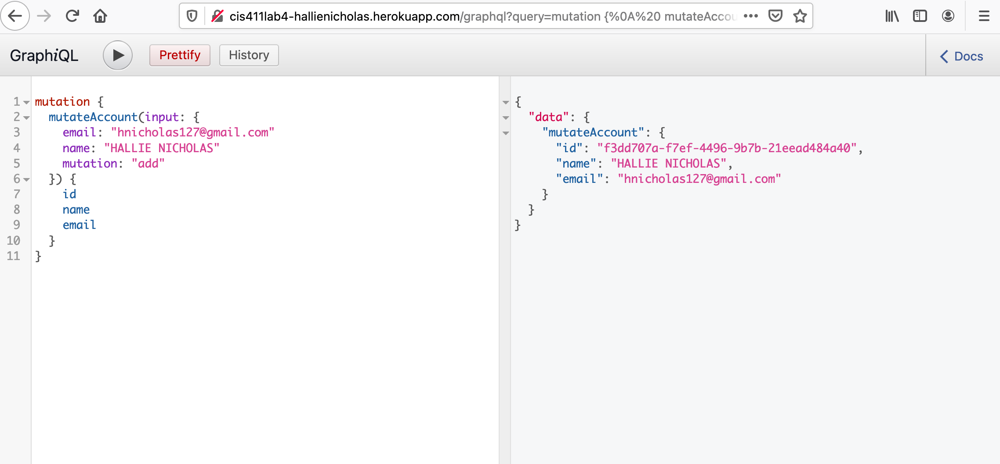

# Lab Report: UX/UI

---

**Course:** CIS 411, Spring 2021  
**Instructor(s):** [Trevor Bunch](https://github.com/trevordbunch)  
**Name:** Felix Zarate  
**GitHub Handle:** felixzrte  
**Repository:** https://github.com/felixzrte/cis411_lab4_CD
**Collaborators:**

---

# Required Content

- [x] Generate a markdown file in the labreports directoy named LAB\_[GITHUB HANDLE].md. Write your lab report there.
- [x] Create the directory `./circleci` and the file `.circleci/config.yml` in your project and push that change to your GitHub repository.
- [x] Create the file `Dockerfile` in the root of your project and include the contents of the file as described in the instructions. Push that change to your GitHub repository.
- [x] Write the URL of your running Heroku app here: https://cis411lab4-felixzrte.herokuapp.com/graphql/
  > Example: [http://cis411lab2-trevordbunch.herokuapp.com/graphql](http://cis411lab2-trevordbunch.herokuapp.com/graphql)
- [x] Embed _using markdown_ a screenshot of your successful build and deployment to Heroku of your project.
  > My Heroku Build: 
- [ ] Answer the **4** questions below.
- [ ] Submit a Pull Request to cis411_lab4_CD and provide the URL of that Pull Request in Canvas as your URL submission.

## Questions

1. Why would a containerized version of an application be beneficial if you can run the application locally already?
   > A containerized version of an app is benneficial because you can run the app on other devices as well, not just locally. The app is put into a container and makes it easy to run.Super lightweight
2. If we have the ability to publish directory to Heroku, why involve a CI solution like CircleCI? What benefit does it provide?
   > CircleCI has the benifit of being able to run tests on your code
3. Why would you use a container technology over a virtual machine(VM)?
   > Containers are very easy to use and are used over a VM because they are transferable. They can be run on other machines too. They are put in a container so they can run relativly fast.
4. What are some alternatives to Docker for containerized deployments?
   > An alternative for docker would be LXC. LXC is also an OS level virtualization method and uses Linux . uses linux kernel.
