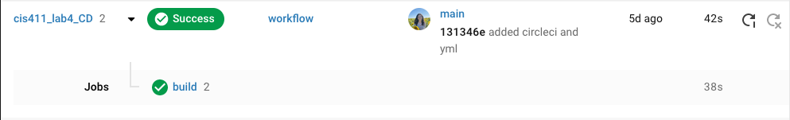

# Lab Report: UX/UI
___
**Course:** CIS 411, Spring 2021  
**Instructor(s):** [Trevor Bunch](https://github.com/trevordbunch)  
**Name:** Hallie Nicholas  
**GitHub Handle:** hallienicholas  
**Repository:** [My Forked Repository](https://github.com/hallienicholas/cis411_lab4_CD.git)  
**Collaborators:** @isaacparada
___

# Required Content

- [x] Generate a markdown file in the labreports directoy named LAB_[GITHUB HANDLE].md. Write your lab report there.
- [x] Create the directory ```./circleci``` and the file ```.circleci/config.yml``` in your project and push that change to your GitHub repository.
  
- [x] Create the file ```Dockerfile``` in the root of your project and include the contents of the file as described in the instructions. Push that change to your GitHub repository.
- [x] Write the URL of your running Heroku app here:  
[http://cis411lab4-hallienicholas.herokuapp.com/graphql](http://cis411lab4-hallienicholas.herokuapp.com/graphql)
- [x] Embed _using markdown_ a screenshot of your successful build and deployment to Heroku of your project.  

- [x] Answer the **4** questions below.
- [x] Submit a Pull Request to cis411_lab4_CD and provide the URL of that Pull Request in Canvas as your URL submission.

## Questions
1. Why would a containerized version of an application be beneficial if you can run the application locally already?
> Even though you can already run the app locally, it is useful to have a containerized version of it for multiple reasons. First of all, it is much faster to use a containerized version because it is isolated and not taking up space and energy from your local machine. Also, it is much simpler to run. If you do not use containerization, you might need to run multiple services just ro run the one app, but a containerized version has everything it needs to run in that one location. Overall, using a containerized version of an app is fast, simple, and portable which makes it an effective way to run an application.
2. If we have the ability to publish directory to Heroku, why involve a CI solution like CircleCI? What benefit does it provide?
> Using a CI solution such as CircleCI along with Heroku is beneficial because when you are publishing to Heroku, the code should always be tested first and continuously so that it can be monitored and checked before deployment. With CircleCI, the process is automated so that whenever you push a commit to master, it will only be pushed to Heroku if it has passed the CircleCI tests. This ensures that everything is working properly and prevents any Heroku directories from having a portion of code on it that makes the app unsuccessful when building. 
3. Why would you use a container technology over a virtual machine(VM)?
> First of all, a virtual machine is a technology for building virtual computing environments, enabling people to run multiple operating systems on a single computer. A container on the other hand provides a quicker and more portable way of doing this by packaging everything needed to run an application or portion of software into that container. This is much easier to do and more beneficial you don't have to waste time and energy of the computer spinning up an entire VM for one small application. Also, when you run a VM, you need a virtual copy of the hardware the OS requires to be run, which is called the guest operating system. However, containers don't need these and instead can grasp the features of the host OS to use. Lastly, there is a great level of flexibilty that comes with containerizing applications. They offer a large amount of scalabilty, rapid deployments and an overall increase in efficiency compared to VMs.
4. What are some alternatives to Docker for containerized deployments?
> 1. **Mesos container** is particularly suited for big data applications environments and is a good alternative to Docker. However, you cannot run these containers without the Mesos framework which could be an inconvience and downside.
> 2. **OpenVZ** is an open source container-based virtualization method that can run many virtual environments on a single Linux OS. Because it is open source, it has a smaller memory footprint, taking up much less space than some other containers. However, when it is run, it focuses on containers for the entire operating system, meaning that it is not ideal for single applications as needed.
> 3. **Containerd** is a container daemon that is regarded as very simple, strong and portable. It is available for Linux and Windows, and also has a stable API that has bug fixes and security patches backported so that older versions are always up to date with the newer ones when it comes to security. Also, due to the fact that it runs as a daemon, it doesn't add too much unnecessary weight to the underlying OS which is definitely beneficial. 