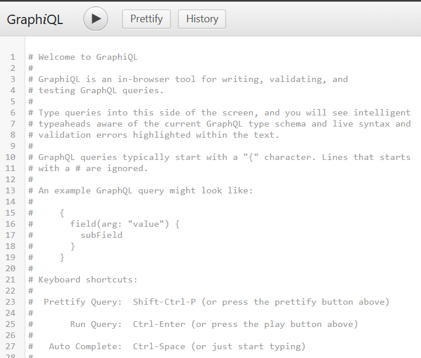
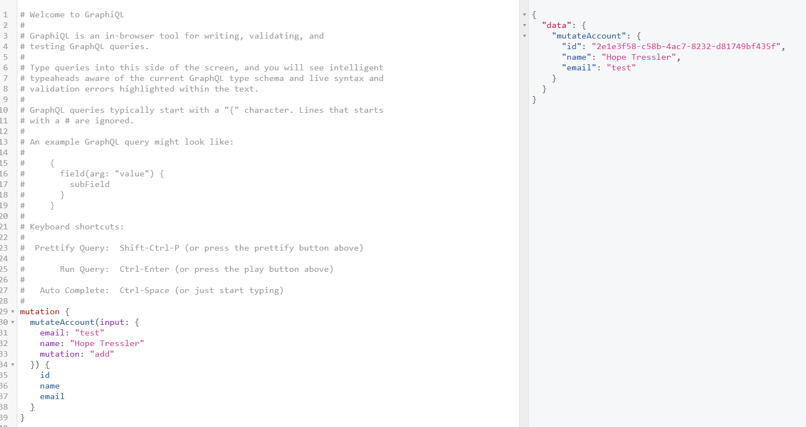
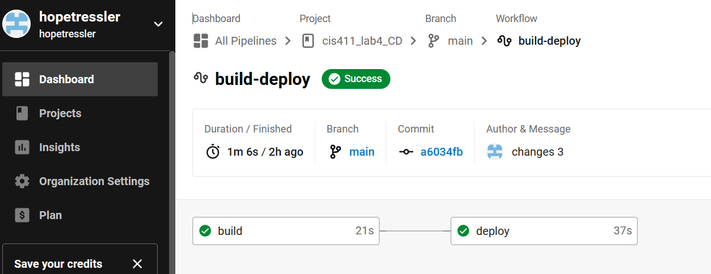
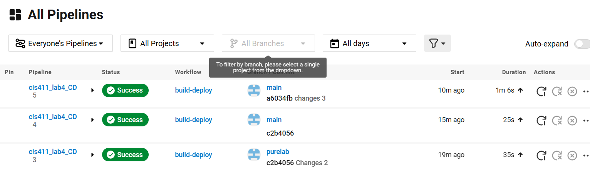

# Lab Report: UX/UI
___
**Course:** CIS 411, Spring 2023  
**Instructor(s):** [Trevor Bunch](https://github.com/trevordbunch)  
**Name:** Hope Tressler  
**GitHub Handle:** hopetressler  
**Repository:**  https://github.com/hopetressler/cis411_lab4_CD.git  
**Collaborators:** 
___

# Required Content

- [X] Generate a markdown file in the labreports directory named LAB_[GITHUB HANDLE].md. Write your lab report there.
- [X] Create the directory ```./circleci``` and the file ```.circleci/config.yml``` in your project and push that change to your GitHub repository.
- [X] Create the file ```Dockerfile``` in the root of your project and include the contents of the file as described in the instructions. Push that change to your GitHub repository.
- [X] Write the URL of your app hosted on Heroku or other Cloud Provider here:  
> URL: [http://cis411lab4-hopetressler.herokuapp.com/graphql](http://cis411lab4-hopetressler.herokuapp.com/graphql)
- [X] Embed _using markdown_ a screenshot of your successful deployed application to Heroku.  
> Deployed Application Screenshot: 
- [X] Embed _using markdown_ a screenshot of your successful build and deployment to Heroku of your project (with the circleci interface).  
> Heroku Deployment with circleci: 




- [X] Answer the **4** questions below.
- [X] Submit a Pull Request to cis411_lab4_CD and provide the URL of that Pull Request in Canvas as your URL submission.

## Questions
1. Why would a containerized version of an application be beneficial if you can run the application locally already?
> A containerized version of an application is beneficial because it eliminates compatibility issues by allowing people from different environments to work on the process simultaneously. It also is beneficial because it takes up fewer resources for a single application as compared to running the application locally on a VM. 
1. If we have the ability to publish directory to Heroku, why involve a CI solution like CircleCI? What benefit does it provide?
> Programs like CIrcleCI allow developers to have their code tested before deploying it. If something is not working, the 'Deploy' section of CircleCI tells us what went wrong and what to fix in order to make it deployable. CircleCI allows for automation and continuous monitoring throughout the application's lifecycle. 
1. Why would you use a container technology over a virtual machine(VM)?
> Virtual machines use more resources to deploy, run, and maintain. This is because application containers can share computing resources and memory without requiring an operating machine for each application to run individually on. 
1. What are some alternatives to Docker for containerized deployments?
> Some alternatives to Docker include Podman, LXD, BuildKit, Kaniko, Vagrant, and Rancher.