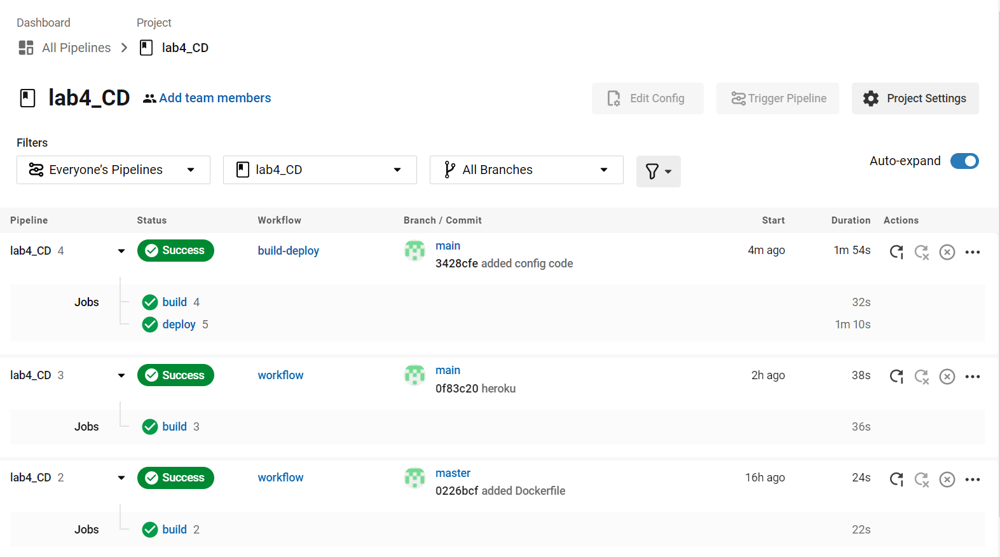
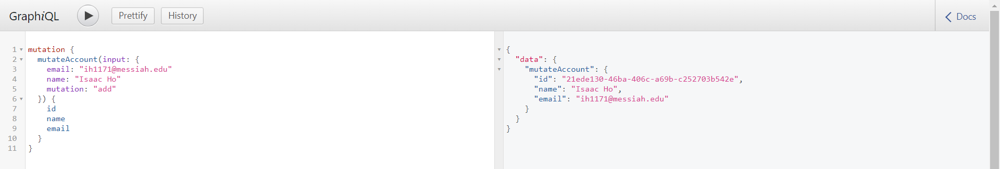

# Lab Report: UX/UI
___
**Course:** CIS 411, Spring 2021  
**Instructor(s):** [Trevor Bunch](https://github.com/trevordbunch)  
**Name:** Isaac Ho
**GitHub Handle:** isaachhm 
**Repository:** https://github.com/isaachhm/lab4_CD.git 
**Collaborators:** Ammanuel Tamrat
___

# Required Content

- [x] Generate a markdown file in the labreports directoy named LAB_[GITHUB HANDLE].md. Write your lab report there.
- [ x Create the directory ```./circleci``` and the file ```.circleci/config.yml``` in your project and push that change to your GitHub repository.
- [x] Create the file ```Dockerfile``` in the root of your project and include the contents of the file as described in the instructions. Push that change to your GitHub repository.
- [x] Embed _using markdown_ a screenshot of your successful build and deployment to Heroku of your project (with the circleci interface).  
> Example: 
- [x] Write the URL of your running Heroku app here (and leave the deployment up so that I can test it): 
> Example: [http://cis411lab4-isaachhm.herokuapp.com/graphql](http://cis411lab4-isaachhm.herokuapp.com/graphql)  
> 
- [x] Answer the **4** questions below.
- [x] Submit a Pull Request to cis411_lab4_CD and provide the URL of that Pull Request in Canvas as your URL submission.

## Questions
1. Why would a containerized version of an application be beneficial if you can run the application locally already?
> A containerized version would allow for collaboration. Multiple people in an organization would be able to work on the project besides just one person working on it.
2. If we have the ability to publish directory to Heroku, why involve a CI solution like CircleCI? What benefit does it provide?
> A CI solution such as CircleCI alongside Heroku would be beneficial because it allows the code to be tested before being deployed. CircleCI will make sure there are no bugs or failures before pushing the app to Heroku. This will save a lot of time when troubleshooting the problems.
3. Why would you use a container technology over a virtual machine(VM)?
> Container technology is less demanding on the system as compared to virtual machines. This is because it does not require an operating system to be installed on the container.
4. What are some alternatives to Docker for containerized deployments?
> LXC, Kubernetes, and RKT are alternatives.