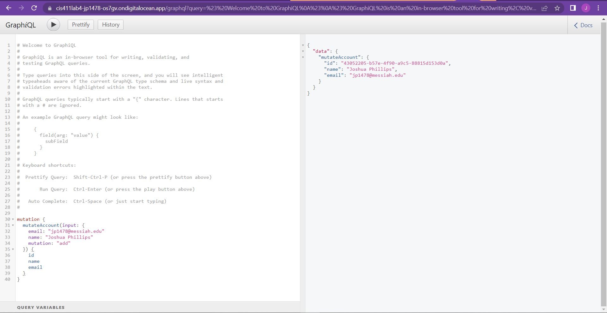
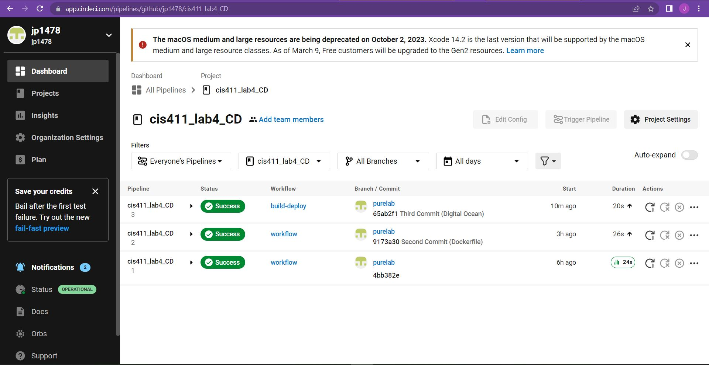

# Lab Report: UX/UI
___
**Course:** CIS 411, Spring 2023  
**Instructor(s):** [Trevor Bunch](https://github.com/trevordbunch)  
**Name:** Joshua Phillips  
**GitHub Handle:** jp1478  
**Repository:** https://github.com/jp1478/cis411_lab4_CD  
**Collaborators:** 02NRA, aidan-hubley
___

# Required Content

- [x] Generate a markdown file in the labreports directory named LAB_[GITHUB HANDLE].md. Write your lab report there.
- [x] Create the directory ```./circleci``` and the file ```.circleci/config.yml``` in your project and push that change to your GitHub repository.
- [x] Create the file ```Dockerfile``` in the root of your project and include the contents of the file as described in the instructions. Push that change to your GitHub repository.
- [x] Write the URL of your app hosted on Heroku or other Cloud Provider here:  
> [https://cis411lab4-jp1478-os7gv.ondigitalocean.app/graphql](https://cis411lab4-jp1478-os7gv.ondigitalocean.app/graphql)
- [x] Embed _using markdown_ a screenshot of your successful deployed application to Digital Ocean.  
> Example: 
- [x] Embed _using markdown_ a screenshot of your successful build and deployment to Heroku of your project (with the circleci interface).  
> Example: 
- [x] Answer the **4** questions below.
- [x] Submit a Pull Request to cis411_lab4_CD and provide the URL of that Pull Request in Canvas as your URL submission.

## Questions
1. Why would a containerized version of an application be beneficial if you can run the application locally already?
> Containers allow the application to be run in any environment. 
> [checkpoint.com](https://www.checkpoint.com/cyber-hub/cloud-security/what-is-container-security/what-is-containerization/#:~:text=Containerization%20is%20a%20type%20of,and%20highly%20conducive%20to%20automation.)
2. If we have the ability to publish directory to Heroku (Digital Ocean), why involve a CI solution like CircleCI? What benefit does it provide?
> It automates the process of testing and deployment by automatically running a series of tests and deploying to Digital Ocean if the tests succeed. This can catch nonfatal errors as well as errors in multiple branches. 
> [circleci.com](https://circleci.com/why-circleci/)
3. Why would you use a container technology over a virtual machine(VM)?
> Containers are less resource intensive than VMs, making them easier to create and destroy, and you can use more of them at a time.  
> [diva-portal.org](https://www.diva-portal.org/smash/get/diva2:1412070/FULLTEXT01.pdf)
4. What are some alternatives to Docker for containerized deployments?
> Alternatives include Cloud Foundry, Containerd, CoreOS rkt, Hyper-V Containers, and more. Docker can only run on Linux systems, so one of these alternatives may be preferable for a Windows or Mac-OS system. 
> [simplilearn.com](https://www.simplilearn.com/docker-alternatives-article)