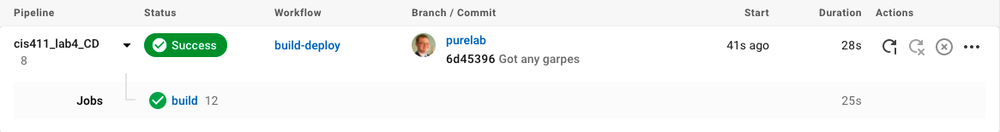
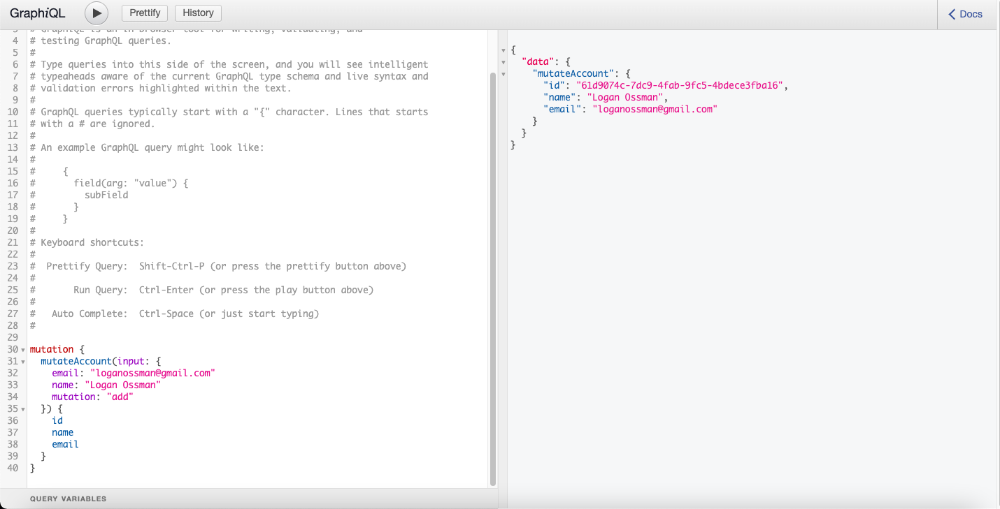

# Lab Report: UX/UI
___
**Course:** CIS 411, Spring 2021  
**Instructor(s):** [Trevor Bunch](https://github.com/trevordbunch)  
**Name:** Logan Ossman  
**GitHub Handle:** loganossman  
**Repository:** https://github.com/loganossman/cis411_lab4_CD  
**Collaborators:** N/A
___

# Required Content

- [x] Generate a markdown file in the labreports directoy named LAB_[GITHUB HANDLE].md. Write your lab report there.
- [x] Create the directory ```./circleci``` and the file ```.circleci/config.yml``` in your project and push that change to your GitHub repository.
- [x] Create the file ```Dockerfile``` in the root of your project and include the contents of the file as described in the instructions. Push that change to your GitHub repository.
- [x] Embed _using markdown_ a screenshot of your successful build and deployment to Heroku of your project (with the circleci interface).  
> Example: 
- [x] Write the URL of your running Heroku app here (and leave the deployment up so that I can test it):  
> [https://cis411lab4-loganossman.herokuapp.com/graphql](https://cis411lab4-loganossman.herokuapp.com/graphql)  
> 
- [x] Answer the **4** questions below.
- [x] Submit a Pull Request to cis411_lab4_CD and provide the URL of that Pull Request in Canvas as your URL submission.

## Questions
1. Why would a containerized version of an application be beneficial if you can run the application locally already?
> Not only can containers allow code to be run on any piece of hardware for many developers to work on it, but it also allows several services to be put in different containers. This allows multiple of them to function, which allows for easier testing.
2. If we have the ability to publish directly to Heroku, why involve a CI solution like CircleCI? What benefit does it provide?
> CircleCI is good for double-checking code across all fronts, not just in Heroku. This can help speed along the testing process, which saves time and money.
3. Why would you use a container technology over a virtual machine(VM)?
> Containers start faster than VMs. It also does not absolutely smash the computer's memory, so things run much smoother.
4. What are some alternatives to Docker for containerized deployments?
> VMs are an alternative to Docker with more security than Docker containers. Several Docker substitues such as Podman, LXD, and Containerd also exist for those who dislike Docker.