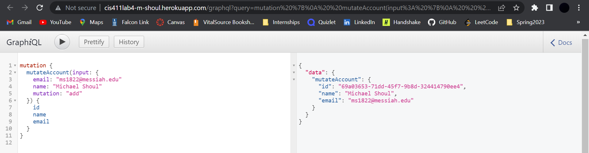
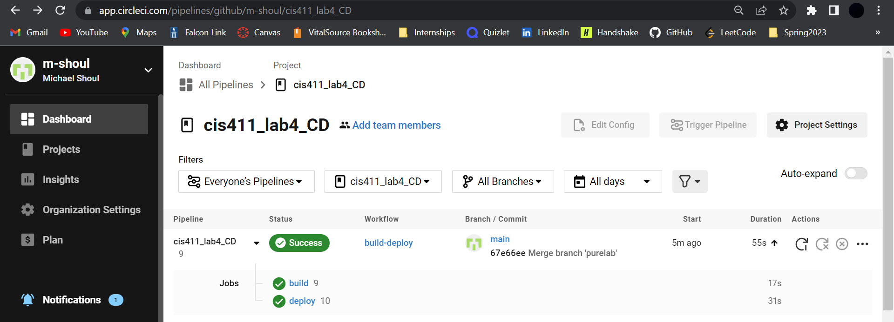

# Lab Report: Continuous Deployment
___
**Course:** CIS 411, Spring 2023  
**Instructor(s):** [Trevor Bunch](https://github.com/trevordbunch)  
**Name:** Michael Shoul  
**GitHub Handle:** [m-shoul](https://github.com/m-shoul)  
**Repository:** [m-shoul / cis411_lab4_CD](https://github.com/m-shoul/cis411_lab4_CD)  
**Collaborators:** 
___

# Required Content

- [X] Generate a markdown file in the labreports directory named LAB_[GITHUB HANDLE].md. Write your lab report there.
- [X] Create the directory ```./circleci``` and the file ```.circleci/config.yml``` in your project and push that change to your GitHub repository.
- [X] Create the file ```Dockerfile``` in the root of your project and include the contents of the file as described in the instructions. Push that change to your GitHub repository.
- [X] Write the URL of your app hosted on Heroku or other Cloud Provider here:
   
> URL: [http://cis411lab4-m-shoul.herokuapp.com/graphql](http://cis411lab4-m-shoul.herokuapp.com/graphql)
  
- [X] Embed _using markdown_ a screenshot of your successful deployed application to Heroku.
  


- [X] Embed _using markdown_ a screenshot of your successful build and deployment to Heroku of your project (with the circleci interface).
  


- [X] Answer the **4** questions below.
- [ ] Submit a Pull Request to cis411_lab4_CD and provide the URL of that Pull Request in Canvas as your URL submission.

## Questions
1. Why would a containerized version of an application be beneficial if you can run the application locally already?
> A containerized version of an application is beneficial for many reasons. One reason is portability. A containerized application can be easily moved between different environments, such as development, testing, and production. Another reason is consistency. By using containers, an application is running natively on the operating system's kernel and can be run in a consistent environment regardless of the hardware and different versions of software. Overall, it makes it easier to manage and deploy an application in a variety of environments.

2. If we have the ability to publish directory to Heroku, why involve a CI solution like CircleCI? What benefit does it provide?
> Continuous integration allows for automation and feedback when deploying an application. Automation can make the process faster, more consistent, and less prone to errors. A solution like CircleCI allows us to automatically build and test the application every time changes are pushed to the repository, which can ensure errors are found and addressed early in the development process. Overall, CI can make the deployment process easier to manage, faster, and more reliable.

3. Why would you use a container technology over a virtual machine(VM)?
> Container technology is more efficient, portable, and scalable than a VM. Using container technology, the application is running natively on the operating system kernel, so it uses fewer resources and can start up and shut down faster than VMs. Using container technology also allows for deployment across different operating systems and hardware infrastructure. Since the containers are both lightweight and portable, they also become easier to scale horizontally to handle increased traffic. 

1. What are some alternatives to Docker for containerized deployments?
> Some alternatives to Docker for containerized deployments:
> 1. Cloud Foundry
> 2. Containerd
> 3. CoreOS rkt
> 4. Kubernetes
> 5. LXC (Linux Containers)  
>
> There are many others among this list and [this article](https://www.simplilearn.com/docker-alternatives-article) lists a lot of alternatives and does a good job of explaining them.