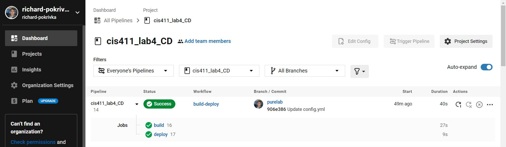

# Lab Report: UX/UI
___
**Course:** CIS 411, Spring 2021  
**Instructor(s):** [Trevor Bunch](https://github.com/trevordbunch)  
**Name:** Richard Pokrivka  
**GitHub Handle:** richard-pokrivka  
**Repository:** https://github.com/richard-pokrivka/cis411_lab0_req 
**Collaborators:** 
@cmculler1
@kfirestone25
___

# Required Content

- [x] Generate a markdown file in the labreports directory named LAB_[GITHUB HANDLE].md. Write your lab report there.
- [x] Create the directory ```./circleci``` and the file ```.circleci/config.yml``` in your project and push that change to your GitHub repository.
- [x] Create the file ```Dockerfile``` in the root of your project and include the contents of the file as described in the instructions. Push that change to your GitHub repository.
- [x] Embed _using markdown_ a screenshot of your successful build and deployment to Heroku of your project (with the circleci interface).  
> Example: 
- [x] Write the URL of your running Heroku app here (and leave the deployment up so that I can test it):  
> Example: [http://cis411lab4-richard-pokrivka.herokuapp.com/graphql](https://cis411lab4-richard-pokrivka.herokuapp.com/graphql)  
> 
- [x] Answer the **4** questions below.
- [x] Submit a Pull Request to cis411_lab4_CD and provide the URL of that Pull Request in Canvas as your URL submission.

## Questions
1. Why would a containerized version of an application be beneficial if you can run the application locally already?

A containerized version allows for collaboration to run very smoothly and allows for multiple people to access the application at the same instead of being just on one local machine.

2. If we have the ability to publish directory to Heroku, why involve a CI solution like CircleCI? What benefit does it provide?
   
A CI solution like CircleCI has the ability to detect errors in code which can be beneficial when theres a massive amount of code. It also allows quick changes to be made. CircleCI also allows code to be tested before being deployed which prevents the need for an app to be removed and redeployed every time an error is found.

3. Why would you use a container technology over a virtual machine(VM)?
   
Container technology is more cost effective, are more scalable because of the quick boot speeds and low downtime, and overall use fewer resources making them faster, more efficient, and easier to manage. Additionally, they have more security built into them.   

4. What are some alternatives to Docker for containerized deployments?

Some alternatives include Podman, Kubernetes, LXC, and RKT