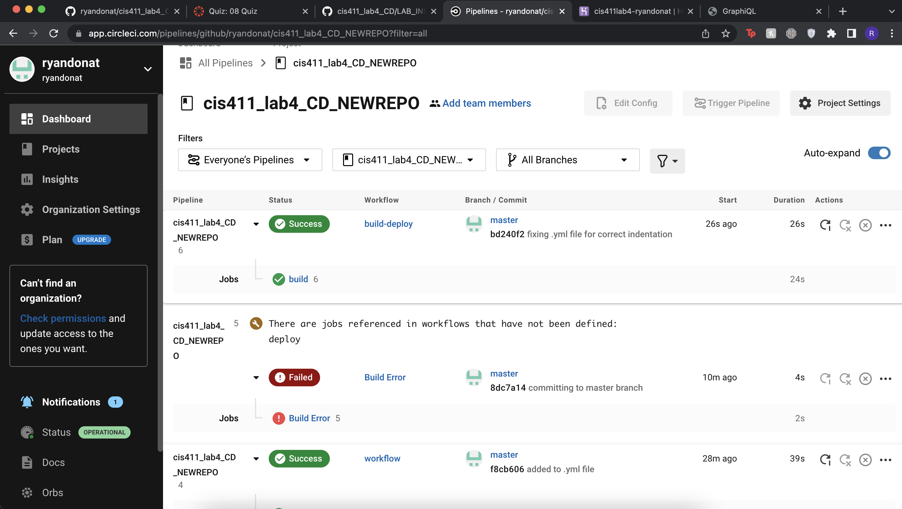

# Lab Report: UX/UI
___
**Course:** CIS 411, Spring 2021  
**Instructor(s):** [Trevor Bunch](https://github.com/trevordbunch)  
**Name:** Your Name  
**GitHub Handle:** Your GitHub Handle  
**Repository:** Your Forked Repository  
**Collaborators:** 
___

# Required Content

- [X] Generate a markdown file in the labreports directoy named LAB_[GITHUB HANDLE].md. Write your lab report there.
- [X] Create the directory ```./circleci``` and the file ```.circleci/config.yml``` in your project and push that change to your GitHub repository.
- [X] Create the file ```Dockerfile``` in the root of your project and include the contents of the file as described in the instructions. Push that change to your GitHub repository.

http://ryandonat.herokuapp.com/graphql

- [X] Embed _using markdown_ a screenshot of your successful build and deployment to Heroku of your project (with the circleci interface).  
> Example: 
- [X] Write the URL of your running Heroku app here (and leave the deployment up so that I can test it):  
> [https://cis411lab4-ryandonat.herokuapp.com/graphql](https://cis411lab4-ryandonat.herokuapp.com/graphql)  
> 
- [X] Answer the **4** questions below.
- [X] Submit a Pull Request to cis411_lab4_CD and provide the URL of that Pull Request in Canvas as your URL submission.

## Questions
1. Why would a containerized version of an application be beneficial if you can run the application locally already?
> A containerized version of an application is beneficial so that people from different systems and enviornments can work on the process simultiously, therefore eliminated compatability issues. This way, anyone can work on the project in the same enviornment.
2. If we have the ability to publish directory to Heroku, why involve a CI solution like CircleCI? What benefit does it provide?
> The entire purpose of a CI solution is to introduce ongoing automation and continuous monitoring throughout the lifecycle of an application, from integration and testing phases to delivery and deployment. This is the benefit that a CI solution provides, instead of just directly publishing to the Heroku directory.
3. Why would you use a container technology over a virtual machine(VM)?
> The main reason I would use container technology over VM just from experience is the effeciency of containers over VM's. VM's use much more resources to deploy, run and maintain. Compared to VM's, containers launch and run in exponentially less time since their order of magnitude is lower.
4. What are some alternatives to Docker for containerized deployments?
> According to Google, the top seven alternatives to Docker are Podman,LXD, Container, Buildah, BuildKit, Kaniko and RunC