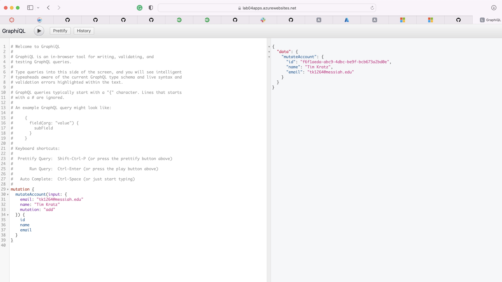
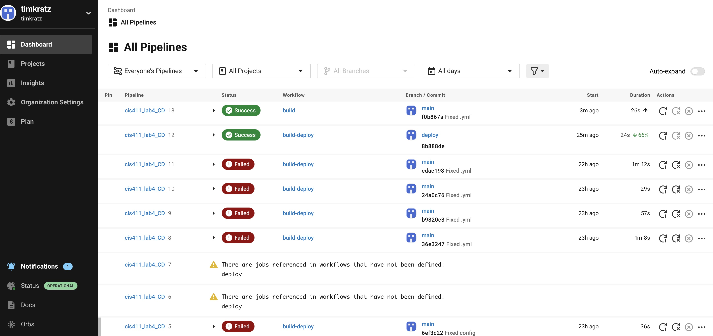

# Lab Report: UX/UI
___
**Course:** CIS 411, Spring 2023  
**Instructor(s):** [Trevor Bunch](https://github.com/trevordbunch)  
**Name:** Tim Kratz  
**GitHub Handle:** timkratz  
**Repository:** https://github.com/timkratz/cis411_lab4_CD.git  
**Collaborators:** Mike Shoul
___

# Required Content

- [x] Generate a markdown file in the labreports directory named LAB_[GITHUB HANDLE].md. Write your lab report there.
- [x] Create the directory ```./circleci``` and the file ```.circleci/config.yml``` in your project and push that change to your GitHub repository.
- [x] Create the file ```Dockerfile``` in the root of your project and include the contents of the file as described in the instructions. Push that change to your GitHub repository.
- [x] Write the URL of your app hosted on Heroku or other Cloud Provider here: http://lab04apps.azurewebsites.net/graphql

- [x] Embed _using markdown_ a screenshot of your successful deployed application to Heroku.  
> 
- [x] Embed _using markdown_ a screenshot of your successful build and deployment to Heroku of your project (with the circleci interface).  
>
- [x] Answer the **4** questions below.
- [x] Submit a Pull Request to cis411_lab4_CD and provide the URL of that Pull Request in Canvas as your URL submission.

## Questions
1. Why would a containerized version of an application be beneficial if you can run the application locally already?
> It is beneficial because it allows for people on different systems and environments to run things at the same time. Anyone is able to work on a project within their same environment. Also the fact that it creates portability is another benefit to having a containerized version of an application. 
2. If we have the ability to publish directory to Heroku, why involve a CI solution like CircleCI? What benefit does it provide?
> It provides the benefit of automation. This leads to the ability to save time and also to catch errors when they show up. This leads to the whole process being more benificial and having a better outcome. 
3. Why would you use a container technology over a virtual machine(VM)?
> I would use a container technology over a virtual machine due to its efficiency. Containers require less memory than VM's and they also launch and run in less time than a VM. 
4. What are some alternatives to Docker for containerized deployments?
> Some alternatives to docker for containerized deployments are Podman, LXD, BuildKit, RunC, Containerd, and more.