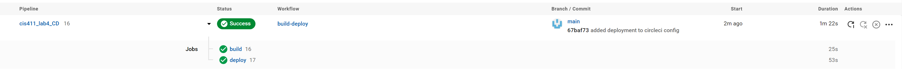
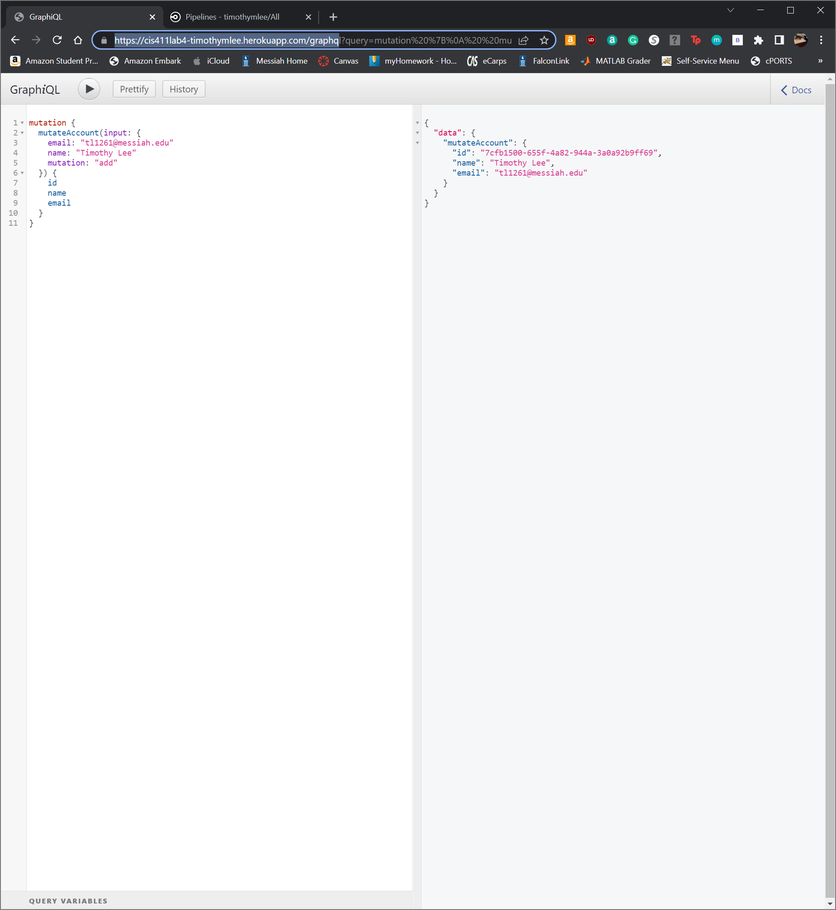

# Lab Report: UX/UI
___
**Course:** CIS 411, Spring 2022 
**Instructor(s):** [Trevor Bunch](https://github.com/trevordbunch)  
**Name:** Timothy Lee  
**GitHub Handle:** timothymlee  
**Repository:** [Forked Repository](https://github.com/timothymlee/cis411_lab4_CD)  
**Collaborators:** 
___

# Required Content

- [x] Generate a markdown file in the labreports directoy named LAB_[GITHUB HANDLE].md. Write your lab report there.
- [x] Create the directory ```./circleci``` and the file ```.circleci/config.yml``` in your project and push that change to your GitHub repository.
- [x] Create the file ```Dockerfile``` in the root of your project and include the contents of the file as described in the instructions. Push that change to your GitHub repository.
- [x] Embed _using markdown_ a screenshot of your successful build and deployment to Heroku of your project (with the circleci interface).  
> 
- [x] Write the URL of your running Heroku app here (and leave the deployment up so that I can test it):  
> [https://cis411lab4-timothymlee.herokuapp.com/graphq](https://cis411lab4-timothymlee.herokuapp.com/graphq)  
> 
- [x] Answer the **4** questions below.
- [x] Submit a Pull Request to cis411_lab4_CD and provide the URL of that Pull Request in Canvas as your URL submission.

## Questions
1. Why would a containerized version of an application be beneficial if you can run the application locally already?
> It is benefitial to use a containerized version of an application because it ensures that the application runs the same across all devices. There is no need to worry about different version of Node or Operating Systems that could change how the program behaviors.
1. If we have the ability to publish directory to Heroku, why involve a CI solution like CircleCI? What benefit does it provide?
> Involving a CI solution acts almost like a control gate, ensuring that failed builds to not get pushed and create major issues. If the application does not build, it will not be deployed and will then not cause problems for the user before the programmer can fix the errors.
3. Why would you use a container technology over a virtual machine(VM)?
> One of the primary reason to use containers instead of virtual machines is that containers are more lightweight. They images are much smaller in space and containers fewer resources. Additionally, containers can spin up very fast and a single system can host many more containers as compared to VMs. [Source](https://www.vmware.com/topics/glossary/content/vms-vs-containers.html#:~:text=Container%20Pros%3A,order%20of%20magnitude%20is%20smaller)
4. What are some alternatives to Docker for containerized deployments?
> Some alternatives to docker include Hyper-V, LXC, rkt, Podman, runC, and containerd.