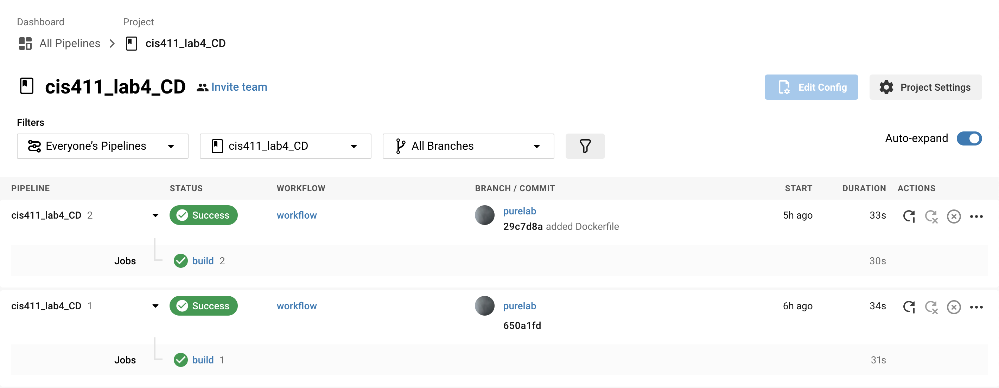
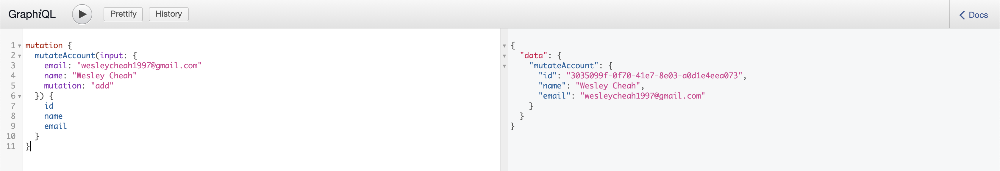

# Lab Report: GitHub + Docker + CircleCI + Heroku
___
**Course:** CIS 411, Spring 2021  
**Instructor(s):** [Trevor Bunch](https://github.com/trevordbunch)  
**Name:** Wesley Cheah  
**GitHub Handle:** [Wesley Cheah](https://github.com/wesleyyycheah)  
**Repository:** [https://github.com/wesleyyycheah/cis411_lab4_CD](https://github.com/wesleyyycheah/cis411_lab4_CD) </br>
**Collaborators:** 
___

# Required Content

- [x] Generate a markdown file in the labreports directoy named LAB_[GITHUB HANDLE].md. Write your lab report there.
- [x] Create the directory ```./circleci``` and the file ```.circleci/config.yml``` in your project and push that change to your GitHub repository.
- [x] Create the file ```Dockerfile``` in the root of your project and include the contents of the file as described in the instructions. Push that change to your GitHub repository.
- [x] Write the URL of your running Heroku app here:  
> Example: [http://cis411lab4-wesleyyycheah.herokuapp.com/graphql](http://cis411lab4-wesleyyycheah.herokuapp.com/graphql)
- [x] Embed _using markdown_ a screenshot of your successful build and deployment to Heroku of your project.  

> CircleCI Successful Build Screenshot
>  </br>

> Heroku GraphQL Screenshot
> 
- [x] Answer the **4** questions below.
- [x] Submit a Pull Request to cis411_lab4_CD and provide the URL of that Pull Request in Canvas as your URL submission.

## Questions
1. Why would a containerized version of an application be beneficial if you can run the application locally already?
> I can think of two benefits of running an app on a container over running it locally. The first one and most obvious one is that it requires less hardware and system resources to run the app as it is done on the cloud. The second one is that it has increased portability. Running an app on the cloud makes it easier for deployments on different operating systems or hardware platforms. 
2. If we have the ability to publish directory to Heroku, why involve a CI solution like CircleCI? What benefit does it provide?
> CircleCI can help developers by being able to be configured to run multiple, complex, pipelines efficiently and with sophisticated caching, docker layer caching, and resource classes for running on faster machines. There are multiple other benefits like running jobs faster with propere configurations in the config.yml file. CircleCI basically makes development faster and more efficient than publishing directly to Heroku,
3. Why would you use a container technology over a virtual machine(VM)?
> Because container technology doesn't require as much resources. Multiple containers can be run on a single virtualized operating system while virtual machines have virtualized hardware to run multiple operating systems, thus using up more power and resources. 
4. What are some alternatives to Docker for containerized deployments?
> There are other alternatives to Docker like LXC, rkt, Kubernetes, and Cloud Foundry.