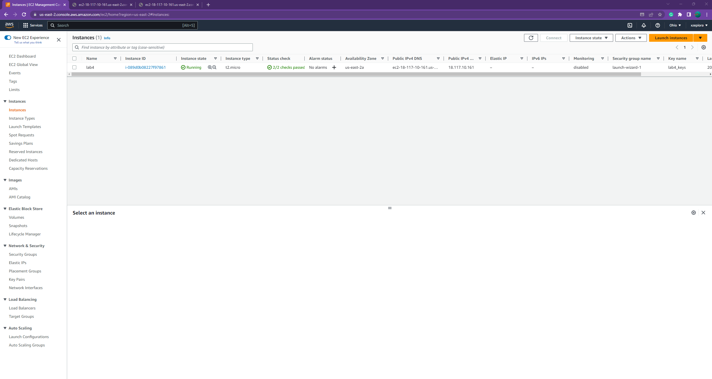
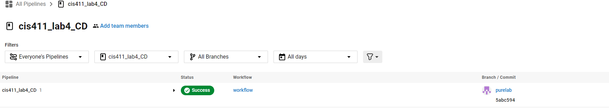

# Lab Report: CD
___
**Course:** CIS 411, Spring 2021  

**Instructor(s):** [Trevor Bunch](https://github.com/trevordbunch) 

**Name:** Xavier Zepiora

**GitHub Handle:** xzepiora

**Repository:** https://github.com/xzepiora/cis411_lab4_CD

**Collaborators:** Ray Truex (rt1252) Mike Shoul (mshoul)
___

# Required Content

- [x] Generate a markdown file in the labreports directory named LAB_[GITHUB HANDLE].md. Write your lab report there.
- [x] Create the directory ```./circleci``` and the file ```.circleci/config.yml``` in your project and push that change to your GitHub repository.
- [x] Create the file ```Dockerfile``` in the root of your project and include the contents of the file as described in the instructions. Push that change to your GitHub repository.
- [x] Write the URL of your app hosted on Heroku or other Cloud Provider here: http://ec2-18-117-10-161.us-east-2.compute.amazonaws.com:4000/graphql

- [x] Embed _using markdown_ a screenshot of your successful deployed application to AWS.  



- [x] Embed _using markdown_ a screenshot of your successful build and deployment to AWS of your project (with the circleci interface).  


- [x] Answer the **4** questions below.
- [ ] Submit a Pull Request to cis411_lab4_CD and provide the URL of that Pull Request in Canvas as your URL submission.

## Questions
1. Why would a containerized version of an application be beneficial if you can run the application locally already?
> A containerized version of an application can be helpful because containers do not require operating systems to be the same. This allows people with different OSs to run a program with no problem. So while locally you might be able to run it no problem when it is running for someone else there might be issues. Containers fix this problem.
1. If we have the ability to publish directory to AWS, why involve a CI solution like CircleCI? What benefit does it provide?
> CircleCI allows for continuous integration as implied by the name. This process of integration means that everytime there is a change you do not need to restart 
1. Why would you use a container technology over a virtual machine(VM)?
> Respond here...
1. What are some alternatives to Docker for containerized deployments?
> Respond here...