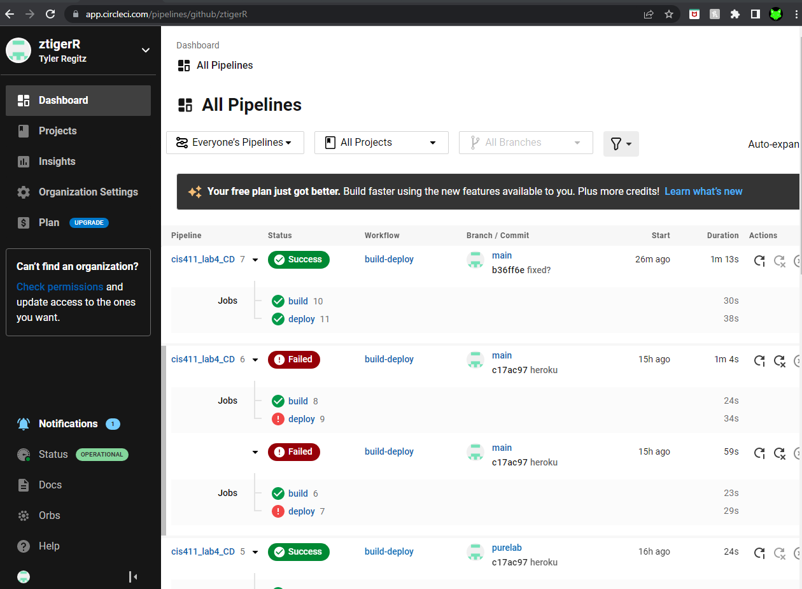

# Lab Report: Cloud Container
___
**Course:** CIS 411, Spring 2022  
**Instructor(s):** [Trevor Bunch](https://github.com/trevordbunch)  
**Name:** [Tyler Regitz](https://github.com/ztigerR)   
**GitHub Handle:** ztigerR  
**Repository:** [Repo](https://github.com/ztigerR/cis411_lab4_CD)    
___

# Required Content

- [ ] Generate a markdown file in the labreports directoy named LAB_[GITHUB HANDLE].md. Write your lab report there.
- [ ] Create the directory ```./circleci``` and the file ```.circleci/config.yml``` in your project and push that change to your GitHub repository.
- [ ] Create the file ```Dockerfile``` in the root of your project and include the contents of the file as described in the instructions. Push that change to your GitHub repository.
- [ ] Embed _using markdown_ a screenshot of your successful build and deployment to Heroku of your project (with the circleci interface).  
> Succesful Build: 
- [ ] Write the URL of your running Heroku app here (and leave the deployment up so that I can test it):  
> Heroku app: [http://cis411lab-ztigerr.herokuapp.com/graphql](http://cis411lab-ztigerr.herokuapp.com/graphql)  
> 
- [ ] Answer the **4** questions below.
- [ ] Submit a Pull Request to cis411_lab4_CD and provide the URL of that Pull Request in Canvas as your URL submission.

## Questions
1. Why would a containerized version of an application be beneficial if you can run the application locally already?
> Running the application locally means that it is only being tested with the operating system that your device uses. We want to design application that are flexible and able to run on multiple operating systems. Running the application on a container allows us to achieve that. The container also helps keep this consistance when working on group projects where different members have different operating systems.
1. If we have the ability to publish directory to Heroku, why involve a CI solution like CircleCI? What benefit does it provide?
> Heroku is an easy way to display the application on a server right away. However this server is not check for errors withing the code being commited. Continous Integration makes the process of finding common errors easier by automaticly testing builds before pushing them to heroku. CircleCI is a way to block dirty uncomplete code from getting onto the build. Heroku does not do this.
1. Why would you use a container technology over a virtual machine(VM)?
> Using a container is way better for smaller projects. It leaves less of an impact on the devices being much smaller than vmware. It is also faster to run and get builds out using a container becasue of the long startup times of vmware. Everything is more effecient with the container.
1. What are some alternatives to Docker for containerized deployments?
> Podman, OpenVZ, and Kubernetes were some of the alternatives mentioned online.