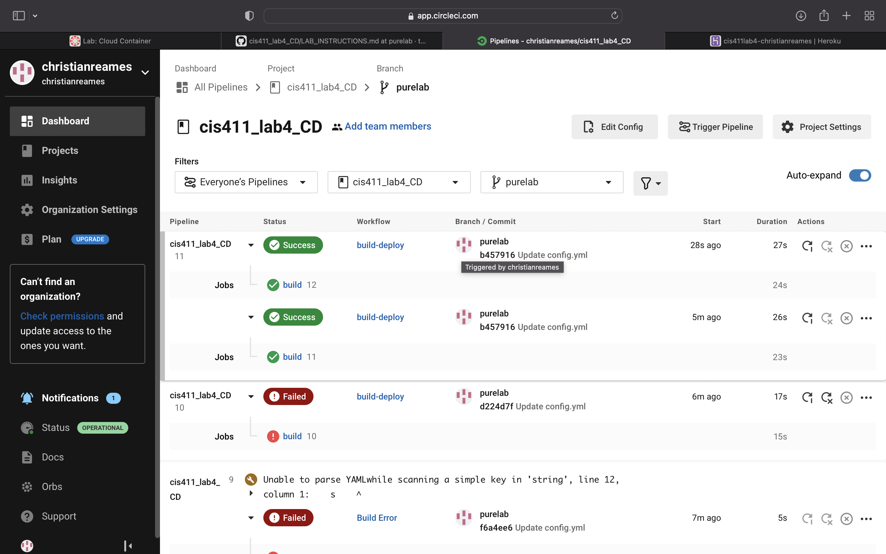
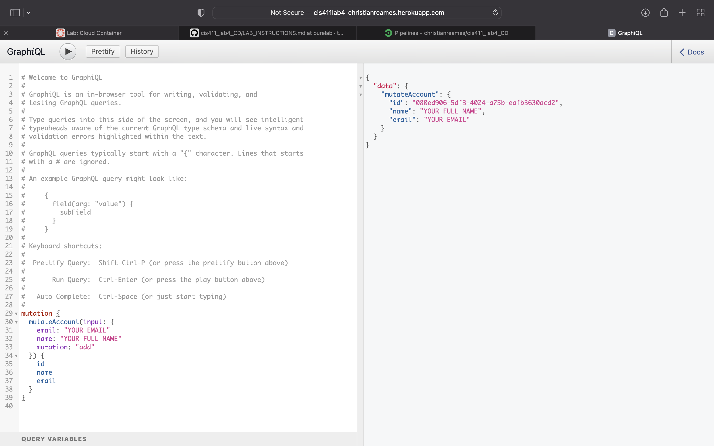

# Lab Report: UX/UI
___
**Course:** CIS 411, Spring 2021  
**Instructor(s):** [Trevor Bunch](https://github.com/trevordbunch)  
**Name:** Christian Reames 
**GitHub Handle:** @christianreames  
**Repository:** https://github.com/christianreames/cis411_lab4_CD.git
**Collaborators:** 
___@richard-pokrivka @cmcculler1

# Required Content

- [Y] Generate a markdown file in the labreports directoy named LAB_[GITHUB HANDLE].md. Write your lab report there.
- [Y] Create the directory ```./circleci``` and the file ```.circleci/config.yml``` in your project and push that change to your GitHub repository.
- [Y] Create the file ```Dockerfile``` in the root of your project and include the contents of the file as described in the instructions. Push that change to your GitHub repository.
- [Y] Embed _using markdown_ a screenshot of your successful build and deployment to Heroku of your project (with the circleci interface).  
> Example: 
- [Y] Write the URL of your running Heroku app here (and leave the deployment up so that I can test it):  [http://cis411lab4-christianreames.herokuapp.com/graphql](http://cis411lab4-christianreames.herokuapp.com/graphql)
 
> 
- [Y] Answer the **4** questions below.
- [Y] Submit a Pull Request to cis411_lab4_CD and provide the URL of that Pull Request in Canvas as your URL submission.

## Questions
1. Why would a containerized version of an application be beneficial if you can run the application locally already?
> Respond here... It allows for smoother collaboration amongst groups of people as well as giving them the ability to access resources at the same time from their own machines. 
2. If we have the ability to publish directory to Heroku, why involve a CI solution like CircleCI? What benefit does it provide?
> CI has the ability to detect errors in code and allows quicker changes to be made. Code can also be tested before it's deployed which improves efficiency. 
3. Why would you use a container technology over a virtual machine(VM)?
> Container technology is more cost effective as well as more scalable due to the fact that boot speeds are faster and downtime is lower. 
4. What are some alternatives to Docker for containerized deployments?
> Some alternatives include Podman, OpenVZ and Kubernetes